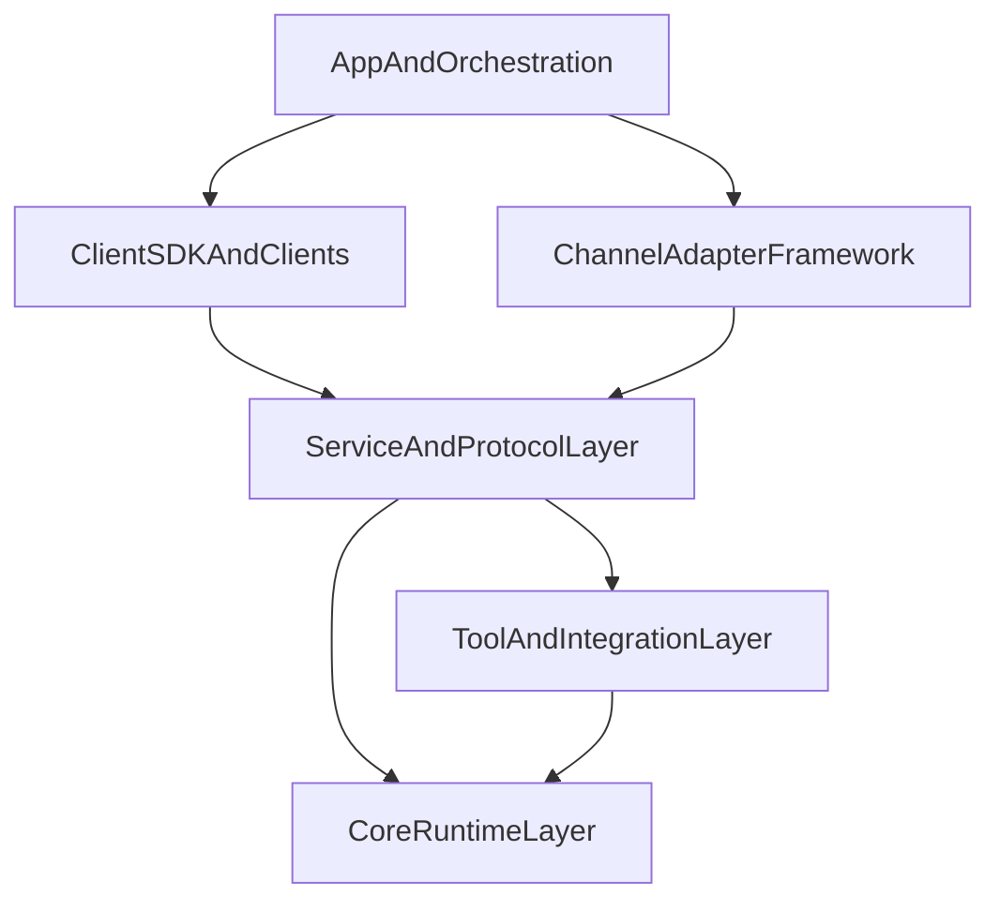

# Architecture

## 目标

`openkin` 的目标不是只做一个后端 Agent 服务，而是逐步演进成一个可扩展的全栈智能体系统。

因此架构需要同时满足两件事：

1. 第一层核心运行时必须稳定
2. 后续服务层、客户端 SDK、即时通讯接入和上层应用都可以在不推翻底层的前提下逐层长出来

## 架构原则

1. 下层是上层的基础设施，上层不应反向侵入下层内部实现。
2. 优先冻结跨层 contract，再实现具体能力。
3. 共享 schema 必须集中沉淀，避免 server、sdk、channel 各自定义一套协议。
4. 平台适配必须通过统一 adapter contract 接入，避免每接一个平台就改核心。
5. 文档、计划、约束、验证都是架构的一部分，不是附属品。

## 演进后的分层



## 各层职责

### 1. Core Runtime Layer

这是当前设计最成熟的一层。

负责：

- Agent 运行时
- Session 与 SessionRuntime
- RunEngine 与 RunState
- ContextManager
- Tool Runtime
- Hook
- Memory Port
- Error / Cancel / Trace 模型

当前第一层关于记忆边界的首期约束是：

- `history` 表示会话内原始消息链
- `memory` 只表示通过 `MemoryPort` 注入的摘要型上下文
- `memory` 必须在 prompt 构建阶段进入 `ContextBlock` 链
- `memory` 进入后仍要经过统一压缩策略，不能在裁剪后绕回 prompt

权威文档：

- `archive/backend-plan/AI_Agent_Backend_Tech_Plan.md`
- `archive/backend-plan/layer1-design/重构版方案/`

### 2. Tool And Integration Layer

负责：

- 内置工具
- Skill
- MCP
- 其他外部能力接入

这一层扩展的是“能力来源”，而不是推翻核心运行时模型。

### 3. Service And Protocol Layer

负责：

- HTTP / WebSocket / Stream API
- 认证与会话入口
- trace 查询入口
- 对外事件协议
- 服务端网关

这一层的关键是：

> 把 Core Runtime 的能力稳定暴露给 SDK、客户端和通道层，而不是把内部细节直接暴露出去。

当前探索分支的最小落地（首期）：

- `packages/shared/contracts` 提供 v1 REST DTO、路由常量与 `StreamEvent` + SSE 线格式约定（`event` = `StreamEvent.type`，`data` = 完整 JSON）。
- `packages/server` 提供最小 `POST /v1/sessions`、`GET /v1/sessions/:sessionId`、`POST /v1/runs`、`GET /v1/runs/:traceId/stream`（SSE），编排 `packages/core` 的 `ReActRunEngine`。
- 验收入口：`pnpm verify` 与 `pnpm test:server`。

### 4. Channel Adapter Framework

负责：

- 即时通讯平台接入
- 账号生命周期
- 入站事件标准化
- 出站消息标准化
- 平台网关管理

它优先抽象统一框架，再逐个接具体平台。

### 5. Client SDK And Clients

当前探索阶段优先做 SDK，不优先做完整客户端 UI。

负责：

- 会话调用 API 封装
- 流式响应消费
- 事件模型封装
- 错误模型对齐

后续 Web、桌面端、移动端都应建立在同一套 SDK 之上。

### 6. App And Orchestration

负责：

- 具体产品体验
- 多 Agent 编排
- 计划模式、投票模式、工作流
- 面向业务的场景化能力

这一层不应反向改写 Core Runtime contract。

## 建议目录形态

```text
packages/
  core/
  lib/
  shared/
    contracts/
  server/
    api/
    gateway/
  sdk/
    client/
  channel-core/
  channel-adapters/
apps/
  dev-console/
docs/
```

## 当前优先实施顺序

1. 建立文档地图与执行计划目录
2. 建立 monorepo 骨架与 shared contracts
3. 落第一层最小运行时闭环
4. 定义 service API 与 streaming contract
5. 落客户端 SDK 最小版本
6. 落 channel adapter framework
7. 再接具体 IM 平台或具体 UI 客户端

## 当前明确不做的事

- 不先做多个 IM 平台
- 不先做完整 Web/Desktop/Mobile 客户端
- 不先做复杂多 Agent 编排
- 不把探索分支上的文档组织强行和 `main` 完全一致
