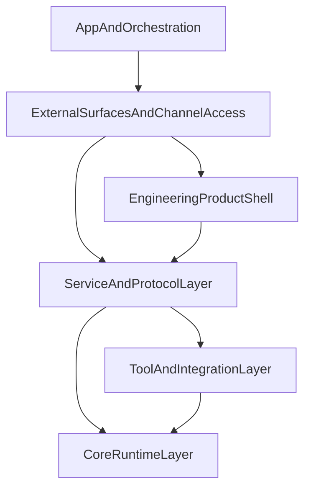

# Architecture

## 目标

`openkin` 的目标不是只做一个后端 Agent 服务，而是逐步演进成一个可扩展的全栈智能体系统。

因此架构需要同时满足两件事：

1. 第一层核心运行时必须稳定
2. 后续服务层、客户端 SDK、即时通讯接入和上层应用都可以在不推翻底层的前提下逐层长出来

## 架构原则

1. 下层是上层的基础设施，上层不应反向侵入下层内部实现。
2. 优先冻结跨层 contract，再实现具体能力。
3. 共享 schema 必须集中沉淀，避免 server、sdk、channel 各自定义一套协议。
4. 平台适配必须通过统一 adapter contract 接入，避免每接一个平台就改核心。
5. 文档、计划、约束、验证都是架构的一部分，不是附属品。

## 演进后的分层



## 后半层统一归属（冻结）

从当前阶段开始，后半层统一按以下口径理解：

- **L3 Service And Protocol Layer**
  - 负责公开 service contract、operator surface、internal surface 与事件协议
- **L4 Engineering Product Shell**
  - 负责 terminal-first 的完整工程产品能力：CLI/TUI、本地 control plane、context / memory / approval / background / resume、single-agent workflow
- **L5 External Surfaces And Channel Access**
  - 负责把 L4 产品能力向外扩展到 Web / Desktop / SDK / channel adapter / remote control plane
- **L6 App And Orchestration**
  - 负责多 Agent、workflow、team、业务应用与更高层产品编排

对用户明确提出的后续系统能力，归属统一冻结为：

| 能力 | 主要归属 |
|---|---|
| 上下文管理工程 | L1 提供最小机制，L4 提供产品化可见性与交互 |
| 多层记忆系统 | L1/L2 提供基础挂点，L4 提供记忆产品面与控制面 |
| 命令鉴权 / 审批 | L2/L3 提供执行与服务边界，L4 提供产品级 capability / approval 语义 |
| 单 agent 完整能力 | L4 |
| 多入口连续性（CLI / Desktop / Web / Channel） | L5 |
| 多 agent / plan / workflow | L6 |

## 各层职责

### 1. Core Runtime Layer

这是当前设计最成熟的一层。

负责：

- Agent 运行时
- Session 与 SessionRuntime
- RunEngine 与 RunState
- ContextManager
- Tool Runtime
- Hook
- Memory Port
- Error / Cancel / Trace 模型
- `LLMProvider`：`MockLLMProvider`（默认 harness）与 `OpenAiCompatibleChatProvider`（OpenAI-compatible `chat/completions`，配置由上层注入）

探索分支下，第一层 **首期 harness**（执行计划 `007`–`012`）已在代码与文档上收口：默认验证为 `pnpm verify`（含第一层 scenarios，不含外网）；真实 OpenAI-compatible 跑通见 `first-layer/DEMO_FIRST_LAYER.md` 与 `pnpm test:first-layer-real`；可靠性边界摘要见 `../governance/RELIABILITY.md`。

当前第一层关于记忆边界的首期约束是：

- `history` 表示会话内原始消息链
- `memory` 只表示通过 `MemoryPort` 注入的摘要型上下文
- `memory` 必须在 prompt 构建阶段进入 `ContextBlock` 链
- `memory` 进入后仍要经过统一压缩策略，不能在裁剪后绕回 prompt

权威文档：

- `architecture-docs-for-human/backend-plan/AI_Agent_Backend_Tech_Plan.md`
- `architecture-docs-for-human/backend-plan/layer1-design/重构版方案/`

### 2. Tool And Integration Layer

负责：

- **内置工具**（`builtin`）：静态注册，同进程函数调用，如 `echo`、`get_current_time`
- **MCP**（`mcp`）：通过官方 `@modelcontextprotocol/sdk` 接入 MCP server（首期 stdio），支持 `listChanged` 动态刷新工具列表；支持运行时热注册（`InMemoryToolRuntime.registerProvider()` / `unregisterProvider()`）
- **Skill**（`skill`）：文档驱动的能力单元；每个 Skill 是 `workspace/skills/<name>/` 目录，包含 `SKILL.md`（能力描述 + 权限声明）和任意脚本；Agent 通过 System Prompt 注入感知可用 Skill 列表，通过 `read_skill` 加载完整文档，通过 `run_script` 执行；`list_skills` 作为兜底工具
- **Agent 自我管理工具**（`builtin`）：`write_skill`（创建新 Skill）、`read_logs`（查看工具调用日志）；与 `manage-mcp` Skill 配合实现 MCP 动态配置
- **自定义工具**（`custom`）：上层业务侧注入的一次性扩展

这一层扩展的是"能力来源"，而不是推翻核心运行时模型。`ToolProvider` / `ToolRuntime` / `ToolExecutor` 接口已冻结，所有新工具来源均通过实现 `ToolProvider` 接入（Skill 除外——Skill 通过内置工具暴露给 Agent）。

**日志系统**：所有工具调用、Skill 执行、MCP 调用均产生结构化日志（JSON Lines），写入 `workspace/logs/`；同时输出格式化文本到 stderr。`Logger` 接口可注入，测试时使用 `NoopLogger`。

**沙箱**（017 起）：`run_script` 在 Deno 可用时使用 Deno 子进程执行，通过 `--allow-read` / `--allow-net` / `--allow-env` 提供进程级权限隔离；权限由 `SKILL.md` frontmatter 的 `permissions` 字段声明。

当前第二层文档：`architecture-docs-for-agent/second-layer/DEMO_SECOND_LAYER.md`、`architecture-docs-for-agent/second-layer/SECOND_LAYER_COVERAGE.md`。

### 3. Service And Protocol Layer

负责：

- HTTP / WebSocket / Stream API
- 认证与会话入口
- trace 查询入口
- 对外事件协议
- 服务端网关

这一层的关键是：

> 把 Core Runtime 的能力稳定暴露给上层产品壳与外部接入层，而不是把内部细节直接暴露出去。

在第三层继续深化之前，服务面对外能力先冻结为三类：

- **client surface**：面向普通客户端与 `packages/sdk/client`，只包含会话、run、run stream、基础健康检查等用户侧调用能力
- **operator surface**：面向受信任的运维侧或服务端应用，包含 trace 查询、metrics、Agent 配置、定时任务等管理与观测能力
- **internal surface**：仅限 loopback / 进程内使用的内部入口，如 `/_internal/*`

在未来扩展时，还要额外预留两类**上层依赖的组合能力**，但它们不应直接压回第一层：

- **product-shell-facing interfaces**：供 L4 的 CLI / TUI / 本地工程产品消费
- **orchestration-facing interfaces**：供多 Agent 编排、工作流、投票模式等上层编排逻辑消费
- **event subscription interfaces**：供 L4 / L5 的 TUI、Web、Desktop、channel bridge 订阅心跳、SSE、任务事件、长运行状态变化等实时信号

冻结规则：

- `packages/sdk/client` 只包装 `client surface`，不默认暴露 operator / internal 能力
- 新增 endpoint、DTO 或 SDK 方法前，必须先声明其属于哪一类 surface，避免把观测、管理、用户调用混成同一套公开协议

当前探索分支的落地状态：

**已完成（004）最小骨架：**
- `packages/shared/contracts` 提供 v1 REST DTO、路由常量与 `StreamEvent` + SSE 线格式约定（`event` = `StreamEvent.type`，`data` = 完整 JSON）。
- `packages/server` 提供 `POST /v1/sessions`、`GET /v1/sessions/:sessionId`、`POST /v1/runs`、`GET /v1/runs/:traceId/stream`（SSE），以及 `/_internal/mcp/*`（loopback-only）。
- 验收入口：`pnpm verify` 与 `pnpm test:server`。

**018（SQLite 持久化，已落地）：**

- DB 路径：`$THEWORLD_WORKSPACE_DIR/theworld.db`（`packages/server/src/db/`：迁移、`SessionRepository` / `MessageRepository` / `TraceRepository`）。
- `POST /v1/sessions` 与成功完成的 `POST /v1/runs` 会写入 `sessions` / `messages`；运行结束通过 `PersistenceHook` 写入 `agent_run_traces`。
- `GET /v1/sessions/:id` 在进程内无会话时会回退查询 DB，以便重启后仍能校验会话存在。
- 验收入口：`pnpm test:persistence`（含重启后 `GET /v1/sessions/:id`）。

**第三层基础服务深化计划（018–023，已归档于 `docs/exec-plans/completed/`）：**

| 计划 | 增量 |
|------|------|
| `018` | SQLite 持久化：Session/Message/Trace 三张表，server 重启后历史不丢失 |
| `019` | Session/Message REST API：列表、消息历史查询、会话删除 |
| `020` | API Key 鉴权、`GET /health` 健康检查、优雅退出、请求体大小限制 |
| `021` | HTTP 系统日志、`GET /v1/runs/:traceId` Trace 查询 API、`GET /metrics`（Prometheus） |
| `022` | Agent 配置 CRUD API（动态创建/更新/禁用 Agent，运行时生效） |
| `023` | 定时任务系统（Cron/Once/Interval 触发，Task Run 持久化，高阶可选） |

第三层基础服务完成后，通过 HTTP 接口可以管理多个 Agent、查询完整推理轨迹、实现鉴权隔离、监控关键指标。

**L3 -> L4 substrate 收口（090–096，已归档于 `docs/exec-plans/completed/`）：**

| 计划 | 增量 |
|------|------|
| `090` | Run identity 与 lifecycle：`RunId` / `executionMode` / `streamAttachment`，attach / interrupt / 续跑最小语义 |
| `091` | Unified event plane：`EventPlaneEnvelopeV1`，task / log / run 映射与订阅语义 |
| `092` | Scheduler reliability and heartbeat：once / interval / cron 可靠性、`runSource`、`taskScheduler.stale` |
| `093` | Approval and danger protocol：`RiskClassDto`、approval REST / SSE、deny / approve / expired 语义 |
| `094` | Context / memory descriptors：`ContextBuildReportDto`、`GET /v1/runs/:traceId/context` |
| `095` | Multimodal contract：`ImagePart` / `FileRefPart`、`RunInputDto.attachments`、`theworld:msg:v1:` 持久化 |
| `096` | Tooling exposure and introspection：`ToolEntryDto.riskClass` / `category` 与 `GET /v1/tools` metadata |

其中需要额外保持的边界是：

- Session / Run / Stream 仍是默认公开的 client contract
- Trace 查询、metrics、Agent CRUD 属于 operator surface，不默认进入 `packages/sdk/client`
- `agentId` 作为一次 run 的选择参数可以属于 client surface，但 Agent 定义的创建、更新、禁用属于 operator surface
- `cancelRun(traceId)` 属于 client surface；其幂等 noop（已终态 run → 200 / `cancelled=false`）也跟随 `packages/sdk/client`
- `GET /v1/sessions/:id/runs` 继续留在 operator surface；Web Console 可直连 operator fetch，但不因此扩张 `packages/sdk/client`

**当前状态更新**：`024` 已补齐 system status / logs / tools / skills / MCP status 自检 API；`026` 已补齐 task 事件 SSE；`027` 已补齐服务端日志 SSE；`046` 已补齐 session run 列表；`090`–`096` 已补齐 L4 所需的 run lifecycle、event plane、scheduler heartbeat、approval、context/memory descriptors、multimodal 与 tooling exposure substrate。第三层当前定位是 **L4 工程产品层的服务底座**，以及 L5/L6 的共享协议层，而不是直接承诺“完整产品能力都在 L3 完成”。

当前第三层文档：

- `architecture-docs-for-agent/third-layer/THIRD_LAYER_COVERAGE.md`
- `architecture-docs-for-human/backend-plan/layer3-design/LAYER3_DESIGN.md`

### 4. Engineering Product Shell

负责：

- CLI / TUI 等 terminal-first 工程产品壳
- 不依赖外部 channel / remote client 也能成立的单 agent 完整能力
- context / memory / permission / approval 的产品化可见性
- background / attach / resume / recover
- session / thread / inspect / logs / tasks 的统一本地工作流
- single-agent 的 plan / review / execute 工程流程

这一层的核心要求是：

> 即使没有 Web、Desktop、IM channel，这个系统也应该先作为一个完整的 CLI/TUI 工程产品成立。

冻结规则：

- 不让 shell 私自重写底层 service contract
- 不把“完整产品能力”误放到 channel / remote client 之后
- 先让 terminal-first 产品闭环成立，再外扩多入口

当前第四层文档：

- `architecture-docs-for-agent/fourth-layer/CHANNEL_ADAPTER_COVERAGE.md`
- `architecture-docs-for-human/backend-plan/layer4-design/LAYER4_DESIGN.md`

### 5. External Surfaces And Channel Access

当前探索阶段优先冻结 **把 L4 产品能力外扩到 remote surfaces 与渠道入口** 的统一接口，而不是让外部接入反向定义产品语义。

负责：

- Web / Desktop / remote client / SDK 的共享接入接口
- channel adapter、账号生命周期、pairing、presence、delivery
- multi-surface continuity
- remote event subscription 与 remote control plane
- 不同外部入口对 L4 产品语义的复用，而不是重定义

这里需要额外明确一层解耦：

- **L4 product shell**：定义完整产品能力首先如何在 terminal-first 场景成立
- **L5 external surfaces**：把这些能力暴露给 Web / Desktop / SDK / channel
- **channel access**：属于 L5 的一种外部入口，而不是 L4 的前提

冻结规则：

- 先有 L4 完整产品，再有 L5 多入口
- 不让 Web / Desktop / channel 各自定义 context / memory / approval / background 的语义
- channel adapter 不能成为“完整产品能力”的替代物

当前第五层文档：

- `architecture-docs-for-agent/fifth-layer/CLIENT_AND_CONTROL_PLANE.md`
- `architecture-docs-for-human/backend-plan/layer5-design/LAYER5_DESIGN.md`

### 6. App And Orchestration

负责：

- 多 Agent、team、router、workflow、业务应用
- 在 L4 产品能力与 L5 外部入口之上做更高层编排
- 组合多个 run / session / agents，而不是重新定义底层 loop
- 多 Agent 编排
- team / subagent / workflow / vote / router
- 面向业务的场景化能力

这一层不应反向改写 Core Runtime contract。

但为了让这一层未来可落地，当前应保持以下边界：

- 多 Agent 编排本质上是多个 `run()` 与多个 Session / Trace 的组织，不应要求第一层理解“Supervisor / DAG / Planner”这些业务概念
- plan mode 本质上是上层两段式流程，不应直接把 plan 数据模型压回 core
- 定时任务当前仍属于第三层基础设施；未来若触发多 Agent 或 plan mode，应通过上层编排层组合，而不是重写调度器语义
- heartbeat 与事件流是跨壳层共同依赖的实时信号，不应只在 CLI 或 Web Console 私有实现

当前第六层的重点，是在 L4 的单 agent 完整产品与 L5 的外部接入成立之后，再推进：

- 多 Agent / team
- workflow / business app
- 高层编排与规则驱动流程

当前第六层文档：

- `architecture-docs-for-agent/sixth-layer/APP_AND_ORCHESTRATION.md`
- `architecture-docs-for-human/backend-plan/layer6-design/LAYER6_DESIGN.md`

## 建议目录形态

```text
packages/
  core/
    src/
      tools/     # builtin 工具实现（echo、get_current_time、read_skill、run_script、write_skill、read_logs、list_skills）
      logger.ts  # Logger 接口 + NoopLogger + 所有 *LogEvent 类型
  lib/
  shared/
    contracts/
  server/
    src/
      logger.ts  # FileLogger 实现（JSON Lines 写入 workspace/logs/）
  sdk/
    client/
    operator-client/
  channel-core/
  channel-adapters/
apps/
  dev-console/
    src/       # 可执行入口（如 demo、交互 REPL）与 demo 共享模块
    tests/     # 第一层 scenarios 与 audit（Mock / 真实 API），由 pnpm test:* 调用
  web-console/ # 当前已存在的上层产品面之一
workspace/           # Agent 运行时工作区（不在 pnpm workspace，由 THEWORLD_WORKSPACE_DIR 配置）
  skills/            # Skill 根目录（每个子目录含 SKILL.md + 任意脚本）
    weather/
    manage-mcp/      # 内置 Skill：MCP server 动态管理
  mcp-registry.json  # MCP server 持久化配置（提交到 git）
  logs/              # 运行时结构化日志（JSON Lines，gitignore）
docs/
  architecture-docs-for-agent/    # 面向 Agent 的架构文档（简洁、结构化）
    first-layer/   # 第一层文档目录
    second-layer/  # 第二层文档目录（Tool & Integration Layer）
    third-layer/   # 第三层文档目录（Service & Protocol Layer 深化）
    fourth-layer/  # 第四层文档目录（Engineering Product Shell）
    fifth-layer/   # 第五层文档目录（External Surfaces / Channel Access）
    sixth-layer/   # 第六层文档目录（App / Orchestration）
  architecture-docs-for-human/    # 面向人类的详细设计文档（历史方案、层设计）
    backend-plan/
      layer1-design/
      layer2-design/
      layer3-design/   # 第三层详细设计
      layer4-design/   # 第四层详细设计
      layer5-design/   # 第五层详细设计
      layer6-design/   # 第六层详细设计
scripts/         # smoke 脚本（test-tools.mjs、test-mcp.mjs、test-skills.mjs 等）
```

`workspace/` 目录通过环境变量 `THEWORLD_WORKSPACE_DIR` 配置，默认指向项目根目录的 `./workspace`，部署时可挂载不同目录。

第一层测试文件说明见 `apps/dev-console/tests/README.md`。

## 当前优先实施顺序

1. 建立文档地图与执行计划目录
2. 建立 monorepo 骨架与 shared contracts
3. 落第一层最小运行时闭环
4. 定义 service API 与 streaming contract
5. 先把第三层之上的本地工程产品能力收口成 L4
6. 再把 L4 产品能力外扩到 Web / Desktop / SDK / channel
7. 最后在此基础上扩展 team / workflow / 业务应用

## 当前明确不做的事

- 不先做多个 IM 平台
- 不先做完整 Web/Desktop/Mobile 客户端
- 不在 shared contract 未冻结前先做复杂多 Agent 编排
- 不把“完整产品能力”寄托在 channel / remote client 接入之后
- 不让单个 shell 私自定义 context / memory / permission / approval 的产品语义
- 不把探索分支上的文档组织强行和 `main` 完全一致
