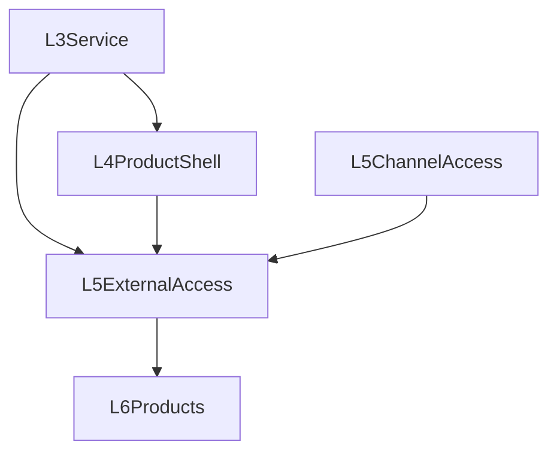

# 第五层设计：External Surfaces / Channel Access / Multi-Surface Continuity

详细能力登记表见：`EXTERNAL_SURFACES_CAPABILITIES.md`。

## 层级定位

第五层不再承担“terminal-first 完整产品”的定义职责。

第五层负责把 **已经在第四层成立的工程产品能力** 外扩到：

- Web / Desktop / remote client
- SDK
- channel adapter / account / pairing / presence
- multi-surface continuity
- remote control plane

它要解决的核心问题是：

1. 一个已经在 CLI/TUI 成立的产品，如何扩展到更多入口
2. channel / remote client 如何复用产品语义，而不是反向定义产品语义
3. 多入口之间的 session、event、approval、background continuity 如何保持一致

## 设计吸收原则

第五层吸收以下外部模式：

- **Claude Code**：terminal-first 成立后，再扩展到 IDE / Cloud 等多 surface
- **OpenCode**：本地产品壳与 external surfaces / teams / integrations 解耦
- **OpenClaw / OpenHanako**：channel、gateway、pairing、presence、event bus 作为外部入口层
- **OpenHarness / ClawCode**：remote runtime、daemon、background、query/control plane 可跨 surface 延展

## 第五层的对象范围

第五层默认包括四类对象：

1. **external client interfaces**
   - `sdk/client`
   - `sdk/operator-client`
   - remote subscription / control-plane clients
2. **channel access**
   - `channel-core`
   - account lifecycle
   - pairing / allowlist
   - presence / delivery
3. **multi-surface continuity**
   - session continuity
   - background session continuity
   - approval continuity
   - event continuity
4. **remote control plane**
   - 非本地 shell 的状态与运维入口

## 当前已落地

| 能力 | 状态 | 说明 |
|---|---|---|
| `packages/sdk/client` | ✅ | session/run/message/health 等基础 client surface 已落地 |
| `packages/sdk/operator-client` | ✅ | tasks、logs、tools、skills、session runs、system status 等 trusted surface 已落地 |
| `packages/channel-core` 最小 framework | ✅ | 已有 mock gateway 闭环 |
| session / run / task / log 等 remote APIs | ✅ | 为 Web / Desktop / remote consumer 提供基础入口 |

## 当前未收口的问题

### 1. Multi-Surface Continuity 仍未成立

现在仓库里已有：

- run stream SSE
- task events SSE
- log SSE

但这些还不是一个统一的“跨入口连续性层”。

后续需要冻结：

- session continuity model
- background session continuity
- approval continuity
- reconnect / replay
- channel / remote surface 的 event continuity

### 2. Channel Access 仍未形成成熟入口层

当前仍缺少统一的：

- account graph
- pairing / allowlist / invitation
- presence / delivery health
- channel capability matrix
- remote/operator override model

### 3. Remote Control Plane 仍未收口

当前 `sdk/operator-client` 能消费部分 trusted surface，但仍缺少：

- remote control-plane client
- channel / account / pairing 的 trusted 管理面
- background session 的远程附着与观察能力
- remote approval / inspect / recover

## 第五层要冻结的核心 contract

### A. External Client Surface

继续由 `sdk/client` 承接：

- session
- message
- run
- cancel
- health

原则：

- 不让第四层的产品语义在不同 remote client 里分叉
- 不让 operator 能力回流到普通 client

### B. Remote Control Plane Surface

由 `sdk/operator-client` 及未来 remote control-plane client 承接：

- traces
- session run lists
- tasks
- logs
- tools / skills
- system status
- channel/account status
- approval queues
- background session registry

### C. Channel Access Layer

第五层显式承接：

- channel adapter
- account lifecycle
- pairing / presence / delivery
- route into L3 service and L4 product semantics

冻结规则：

- channel 是一种外部入口，不是完整产品能力的前提
- channel 不反向定义 context / memory / approval / background 的语义
- 真实平台接入晚于 L4 产品闭环

### D. Multi-Surface Continuity

第五层需要冻结：

- attach / resume / inspect across surfaces
- shared event identity
- background run continuity
- approval continuity
- session / thread continuity across local and remote views

## 与用户提出的系统能力的关系

你当前明确关心的这些能力，在第五层中的归属如下：

| 能力 | 第五层职责 |
|---|---|
| 上下文管理工程 | 不定义本地产品语义，但保证这些语义能被 remote surfaces / channel 复用 |
| 多层记忆系统 | 不定义记忆产品面，但保证 multi-surface continuity 与 remote inspect 可以承接 |
| 命令鉴权 | 承接远程 / channel / multi-surface 的 approval continuity |
| 单一 agent 完整能力 | 不再是第五层主责；第五层负责把 L4 能力外扩到更多入口 |

## 当前推荐结构

## 推荐执行顺序

1. **Wave A：L4 first**
   - 先让 terminal-first 单 agent 产品闭环成立
2. **Wave B：external surfaces**
   - Web / Desktop / SDK / remote control plane
3. **Wave C：channel access**
   - account / pairing / presence / representative platform
4. **Wave D：L6 orchestration**
   - 在 L4/L5 稳定后再做 team / workflow / app

## 当前结论

第五层今天不应再被理解为“单 agent 完整产品层”。

它应被视为：

- external client access
- remote control plane
- channel access
- multi-surface continuity

四者合并后的统一外扩层。

当前仓库已经有了基础 SDK 和最小 channel framework，但还没有完整收口：

- remote continuity model
- channel account / pairing / presence / delivery
- remote approval / background / attach semantics
- Web / Desktop / channel 对 L4 产品语义的稳定复用

这些正是完整 terminal-first 产品成立之后的下一层问题。
