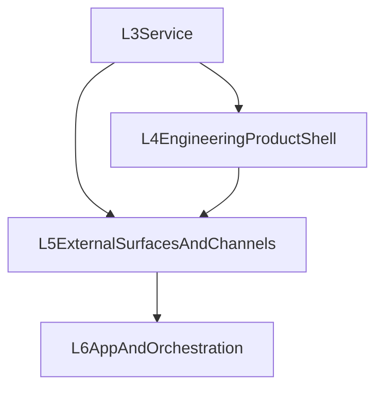

# 第四层覆盖矩阵：Engineering Product Shell

> 说明：文件路径沿用历史命名以保持引用连续性，但当前第四层口径已改为 **Engineering Product Shell**，不再是 Channel Adapter Framework。

详细能力登记表见：`ENGINEERING_PRODUCT_CAPABILITIES.md`。

## 层级定位

第四层不是外部渠道接入层，而是 **不依赖 channel / remote client 也能成立的完整工程产品层**。

它位于：

- 下游依赖：[`../third-layer/THIRD_LAYER_COVERAGE.md`](../third-layer/THIRD_LAYER_COVERAGE.md) 的 service / event / operator primitives
- 上游承接：[`../fifth-layer/CLIENT_AND_CONTROL_PLANE.md`](../fifth-layer/CLIENT_AND_CONTROL_PLANE.md) 与 [`../sixth-layer/APP_AND_ORCHESTRATION.md`](../sixth-layer/APP_AND_ORCHESTRATION.md)

它解决的问题是：

1. 即使没有 Web、Desktop、IM channel，用户能否仅通过 CLI/TUI 获得完整产品能力
2. `opencode` / `claudecode` 这类 terminal-first 产品能力，应归在什么层
3. context / memory / permission / approval / background / resume，如何先成为产品能力，而不是渠道附属物

## 设计吸收原则

第四层吸收以下外部优秀模式，但不直接复制实现：

- **Claude Code / OpenCode**：先让 terminal-first 产品成立，再考虑 IDE / Desktop / Cloud / team
- **OpenHarness / ClawCode**：把 permissions、background sessions、resume、context accounting 当作产品外壳能力
- **OpenClaw / OpenHanako**：承认长期运行 agent 需要 control plane，但不把本地产品闭环让位给 channel gateway

## 第四层负责什么

第四层统一负责：

- CLI / TUI 的完整工程产品壳
- session / thread / inspect / logs / tasks 的本地工作流
- context engineering 的产品化可见性
- layered memory 的产品化可见性与操作面
- capability / permission / approval 的产品语义
- background / attach / resume / recover
- single-agent 的 plan / review / execute 工程流程

关键判断是：

> 如果一个能力应该在“只有 CLI/TUI、本地 server、本地 workspace”的情况下成立，它优先属于第四层。

## 当前已落地基础

| 能力 | 状态 | 说明 |
|---|---|---|
| CLI chat / session / inspect / tasks 基础入口 | ✅ | `packages/cli` 已形成基础工作壳 |
| 全屏 TUI 基础 | ✅ | 已有 transcript、sidebar、input bar、status bar 等基础结构 |
| 第三层 operator / introspection APIs | ✅ | 为本地产品层提供 system status / logs / tools / skills / session runs 等基础支撑 |
| `sdk/operator-client` / `sdk/client` | ✅ | 为本地产品层调用服务接口提供初始封装 |

## 当前未完成的关键缺口

### 1. Context Engineering 仍未成为产品面

当前仍缺少统一的：

- context usage snapshot
- compact boundary 可见性
- prompt source breakdown
- memory contribution summary

这意味着上下文仍然更像内部机制，而不是产品能力。

### 2. Layered Memory 仍未成为产品面

当前仍缺少统一的：

- session memory / summary / long-term memory 的产品叙事
- inspect / save / pin / ignore / summarize 等操作面
- memory policy visibility

### 3. Permission / Approval 仍未形成工程产品闭环

当前仍缺少统一的：

- permission mode
- approval request / response model
- blocked / awaiting approval / denied / resumed 的状态语义
- 工具能力边界在 TUI / CLI 中的稳定展示

### 4. Background / Resume 仍未形成系统能力

当前仍缺少统一的：

- background session registry
- attach / detach / resume / interrupt / kill
- 前后台切换后的状态持续性
- 失败后恢复路径

### 5. Single-Agent Workflow 仍未收口

当前仍缺少统一的：

- 单 agent 的 `plan -> review -> execute`
- 工程产品中的 artifact / audit / run-state continuity
- workspace / worktree / long task handoff 的产品约束

## 与第三层的边界

第四层不要求把所有产品能力都堆进第三层。

第三层负责：

- 稳定服务 contract
- event plane primitives
- trusted operator APIs

第四层负责：

- 用这些 primitives 组合成完整工程产品

但第四层也会反过来提出 **L3 prerequisite gaps**。当前最重要的候选补口是：

- 更稳定的 event subscription 组合面
- background session / active run 的更强标识与恢复支持
- context / memory / approval 相关 snapshot 或 descriptors

这些属于“为 L4 服务的 L3 增量”，而不是把 L4 自身吞回 L3。

## 与第五、第六层的关系

说明：

- L3 提供服务底座
- L4 先把本地工程产品做完整
- L5 再把 L4 产品能力外扩到 Web / Desktop / channel / remote SDK
- L6 最后在此基础上做多 Agent 与业务应用

## 推荐执行波次

1. **Wave A：L3 -> L4 substrate gaps**
   - event plane、active run identity、background / resume primitives、context/memory descriptors
2. **Wave B：L4 product completeness**
   - context、memory、permission、approval、background、recover、single-agent workflow
3. **Wave C：product shell polish**
   - 把 TUI / CLI 从“可用壳”提升为“完整工程产品”

## 当前结论

第四层今天已经有了不少基础，但它还没有成为用户所说的那种：

- 不依赖渠道接入
- 不依赖 remote client
- 仅通过 CLI/TUI 就能完整工作的工程产品

这正是第四层接下来必须承担的主责。
