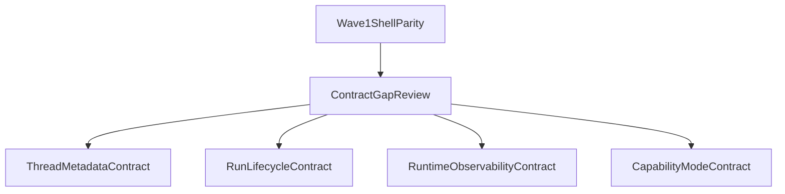

# CLI Shell Contract Gaps

## 目标

本文件用于把 TheWorld CLI shell parity 过程中发现的**非壳层问题**显式分类。

目的不是立即承诺所有新 contract，而是回答两个问题：

1. 哪些差距仍可以在 CLI shell 内解决？
2. 哪些差距已经需要新的 client/server/shared contract？

本文件承接：

- `docs/requirements/THEWORLD_CLI_SHELL_PARITY_DESIGN.md`
- `docs/requirements/THEWORLD_TUI_PRODUCT_DESIGN.md`

---

## 分类原则

### A. 可继续留在 CLI shell

满足以下条件之一的，优先留在 shell：

- 只需要重组已有 `streamRun` / `getSession` / `getMessages` / `listSessions` 数据
- 只涉及显示、排序、布局、交互路径或本地缓存
- 不要求 server 为 shell 新增字段、事件或 endpoint

### B. 必须进入 contract 路线

命中以下任一条件，即不应继续伪装成 shell-only 任务：

- 需要 server 返回新的 thread / run / model / usage 元数据
- 需要新的 event 才能支撑 UI 语义
- 需要新的 client-sdk / operator-client surface
- 需要真实 capability boundary 才能支撑 mode 或 permission affordance

---

## 当前可在 shell 内解决的 parity 差距

以下差距仍属于 Wave 1：

### 1. Home shell 与空态

- 品牌位
- recent thread 入口排布
- command discoverability
- help surface 信息架构

依赖现有 `listSessions` 与 CLI 本地能力即可推进。

### 2. Conversation shell 信息架构

- transcript viewport 心智
- header / footer / status rail 角色划分
- tool/result 摘要展示
- run phase 的界面归属

这些都属于 presentation architecture。

### 3. Session / thread UX 的第一层收口

- `displayName -> alias -> shortId`
- list / picker / resume / footer / error 的统一叙事
- TTY attach / pick 路径

在既有 `listSessions` / `getSession` 能力上可先完成第一轮。

### 4. Input / command affordance

- footer 输入层级
- slash discoverability
- shell hint / topic help 对齐
- degraded-mode 与 narrow terminal 策略

仍属于 CLI shell 责任。

---

## 已经接近 contract 边界的差距

这些能力可能可以先做壳层版本，但很容易触及 contract 上限。

### 1. Rich thread previews

当前 recent threads 若只靠 `listSessions`，可展示的通常只有：

- `displayName`
- `kind`
- `agentId`
- `createdAt`

如果希望达到参考项目级 thread 列表体验，未来可能需要：

- 最后消息预览
- 最后活跃时间
- 最近 run 状态
- 未完成 / 失败 / 需要 attention 的 thread 标记

这些一旦需要稳定来源，就不再只是 shell 问题。

### 2. Active run interruption

当前 CLI shell 可以先规划“中断 affordance”的产品位置，但更完整的体验很可能需要：

- 更明确的 active run identity
- shell 与 run lifecycle 的稳定绑定
- attach 到正在运行的 run

仓库里已有 `cancelRun(traceId)` surface，可先评估复用；但如果要做成熟的 interrupt/attach UX，可能还需要更多 contract 辅助信息。

### 3. Model / runtime visibility

当前 shell 可展示：

- env label
- `agentId`

但如果要达到参考项目级可见性，未来可能需要：

- 实际运行模型名
- runtime/provider 信息
- tool timing / run stage 元数据

这通常不应由 shell 自己猜。

---

## 明确需要进入 Wave 2 contract 路线的候选项

以下能力一旦立项，应直接走高能力模型的 contract 设计，而不是塞进 budget-mode shell 工单。

### 1. Thread metadata contract

候选能力：

- last message preview
- last run status
- last active timestamp
- unread / attention / failure marker
- richer thread sorting / filtering

影响层：

- `packages/shared/contracts`
- `packages/sdk/client`
- `packages/server`
- 可能波及 operator surfaces

### 2. Run lifecycle contract

候选能力：

- attach to active run
- stronger interrupt / cancel semantics
- richer run state event model
- stable shell resume after reconnect

说明：

- 若仅调用已有 `cancelRun(traceId)`，仍可先作为 shell 消费
- 若需要新的 run progress 语义，就属于 contract 路线

### 3. Runtime observability contract

候选能力：

- token / cost / context window 近似或精确值
- model/provider identity
- tool latency / run timing
- richer diagnostic summaries for shell rails

说明：

这些能力若没有统一来源，shell 很容易退化成“猜出来的 UI”。

### 4. Capability / mode contract

候选能力：

- read-only / plan / build / permission 等模式
- tool write restrictions
- approval / permission workflow

说明：

只有当真实 capability boundary 已存在，CLI shell 才应显示对应 mode。

---

## 推荐推进顺序

1. 先完成 Wave 1 shell parity，把壳层极限做到位。
2. 再对照本文件，逐项确认哪些差距仍真实存在。
3. 仅对仍无法靠壳层解决的部分开启新的 contract exec-plan。

---

## 对 budget-mode 的约束

budget-mode 工单默认**不**应自行推进以下内容：

- 新 thread metadata DTO
- 新 run events
- 新 model/runtime visibility fields
- fake mode surfaces
- 任意“为了更像参考项目而顺手新增 API”的行为

这些能力一律需要先回到 high-capability mode，基于本文件收口方向。

---

## 相关文档

- `docs/requirements/THEWORLD_CLI_SHELL_PARITY_DESIGN.md`
- `docs/requirements/THEWORLD_TUI_PRODUCT_DESIGN.md`
- `docs/architecture-docs-for-agent/first-layer/SDK.md`
- `docs/architecture-docs-for-agent/third-layer/THIRD_LAYER_COVERAGE.md`
