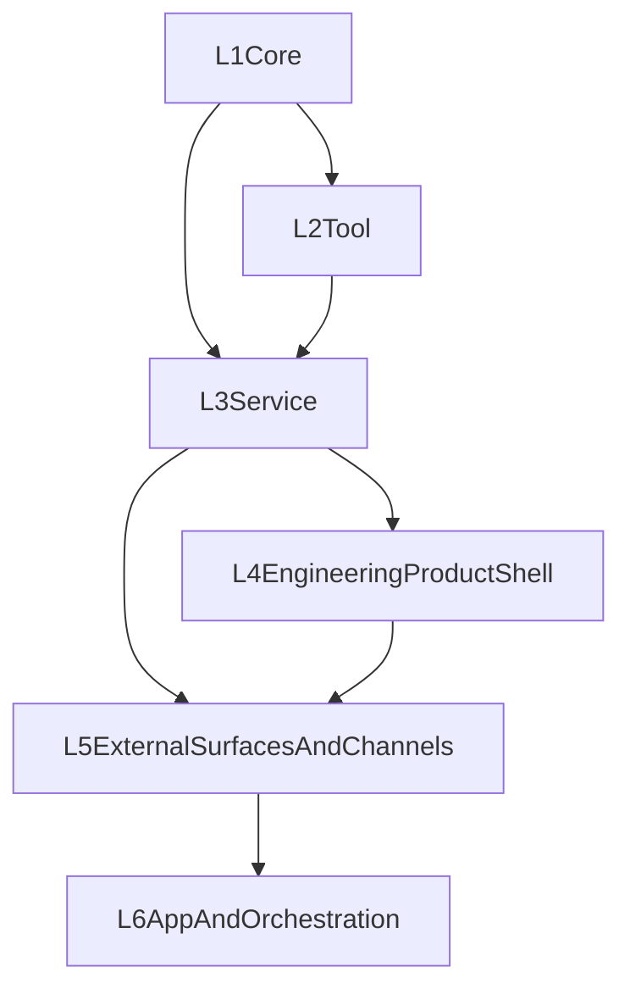

# 第六层设计：App And Orchestration

详细能力登记表见：`ORCHESTRATION_AND_APP_CAPABILITIES.md`。

## 层级定位

第六层是 **高层产品与编排层**。

它不负责替第四层完成单 agent 的 terminal-first 产品闭环，也不负责替第五层处理外部入口接入。它负责在这些基础已经成立之后，构建更高阶的产品系统。

这个层级要回答两个问题：

1. **在单 agent 产品成立后，多个 agent、workflow、业务应用如何长出来？**
2. **这些更高阶能力如何不污染底层 contract？**

## 第六层的阶段目标

### 阶段 A：Orchestration

在第四层与第五层成立后，再推进：

- subagent / teammate / team
- plan / review / execute
- workflow / vote / router / supervisor
- 后台目标循环与持续工作

### 阶段 B：Product Apps

继续向上形成：

- 场景化产品
- 业务编排
- 多 agent 工作台
- 更高层审计、通知与协作系统

## 设计吸收原则

第六层吸收以下外部优秀模式：

- **Claude Code**：在单 agent 产品成立后，再扩展到更高层 workflow 与多 surface 协作
- **OpenCode**：Build / Plan primary agents、subagents、teams、侧栏状态与任务编排
- **OpenClaw / OpenHanako**：长期运行系统、hub / scheduler / event bus / 多入口编排
- **OpenHarness / ClawCode**：background sessions、plans、coordinator、daemon、query engine 的更高层组合

但第六层明确 **不复制**：

- 外部项目的具体命名
- 外部项目的私有 transport / renderer
- 把尚未成立的单 agent 产品能力直接包装成“多 agent 平台”

## 与第四层的边界

以下能力现在默认属于第四层，而不是第六层：

- terminal-first 单 agent 完整产品闭环
- CLI/TUI 的 context / memory / permission / approval / background / resume 产品能力
- 单 agent 的本地工程工作流

第六层默认建立在这些能力已经成立之上。

## 第六层的对象范围

### 1. Orchestration Surfaces

包括：

- multi-agent workbench
- orchestration consoles
- scenario / domain apps
- higher-level operator surfaces

### 2. Orchestration Products

包括：

- plan mode
- multi-agent teams
- router / lead / teammate patterns
- workflow runs
- goal loops

### 3. Product Apps

包括：

- 面向具体场景的 agent 应用
- 跨入口业务流程
- 更高层通知、审计、协作系统

## Plan / Review / Execute

第六层默认把“计划先行”视为 **编排与高层产品流程**，而不是单个 prompt 技巧。

建议冻结为：

1. `plan`
2. `review`
3. `approve_or_revise`
4. `execute`
5. `observe_and_recover`

这里的重点不是把 plan 塞回 L1，也不是替第四层去定义单 agent 基础 UX，而是：

- plan artifact 是 L6 产品对象
- approval / revision 是 L6 产品交互
- execute 可以组合多个 Session / Run / Task / Agent

## Team / Subagent / Orchestrator 模型

第六层默认承认以下模式是未来正式对象：

### A. Subagent

- 短生命周期
- 隔离上下文
- 为主会话提供一个结果
- 不等于第四层的单 agent 本地工作壳

### B. Team

- 一个 lead
- 多个 teammate
- 共享任务板
- 每成员独立 session / status
- 可观测的 team state

### C. Orchestrator

- 专门做路由、计划、选择模型 / agent / backends
- 不等于执行 agent 本身

### D. Goal Loop / Background Worker

- 非交互式长期运行
- 可暂停、继续、停止、重试
- 带审计与通知

## 背景会话与工作树责任

如果未来 TheWorld 要承接 coding-agent / operator-agent 的多 agent / team / workflow 形态，第六层必须负责：

- background orchestration registry
- attach / resume / interrupt across orchestrated work
- worktree / branch / workspace isolation policy
- audit trail
- post-run merge / PR / artifact handoff

这些能力不应直接污染第三层的基础 Session/Run contract，但第六层必须冻结高层产品责任边界。

## 与前五层的关系

### 归属规则

- L1 负责 loop、context block、minimal memory port、tool runtime
- L2 负责 tools / MCP / skills / sandbox
- L3 负责 public/operator/internal surfaces
- L4 负责完整工程产品壳与单 agent 产品闭环
- L5 负责 external surfaces、channel access、multi-surface continuity
- L6 负责多 agent、workflow、business app 与高层编排

## 当前仓库状态

### 已有基础

- CLI / TUI 已经提供第四层产品面的初始形态
- Web Console、SDK、channel framework 提供第五层外部入口的初始形态
- tasks、logs、session runs、stream、cancel、agent CRUD、system status 已为更高层产品提供大量基础设施

### 明确未完成

- team / subagent / router / workflow 的正式 contract
- 面向 orchestration 的 plan / review / execute 稳定工艺
- 编排态 background / goal loop / coordinator registry
- 高层审计、产物、通知与业务应用边界

## 推荐实施顺序

1. **Wave A：L4 / L5 先成立**
   - 先补齐单 agent 产品闭环与 external surfaces
2. **Wave B：Plan / Review / Execute**
   - 面向 orchestrated work 的计划、审批、修订与执行流
3. **Wave C：Team And Orchestrator**
   - subagent、lead / teammate、task board、team observability
4. **Wave D：Workflow / Product Apps**
   - 长期后台编排、规则触发、跨 surface 通知、业务应用

## 当前结论

第六层不是“把单 agent 的 CLI/TUI 做完整”。

它是把：

- team / subagent / workflow
- 高层计划 / 审批 / 后台编排
- 业务应用与多 agent 产品面

收束为正式产品层 contract 的地方。

当前仓库已经有很多实现碎片，但第六层现在应明确建立在 L4/L5 之后；本文件的目标就是把这些高层编排对象上升为统一边界。
