# 第一层图册：边界、结构与执行流程

> 文档定位：配合 `第一层_通用Agent基础框架详细设计.md` 阅读的可视化图册  
> 目标：用关系图、架构图、时序图、数据流向图、执行流程图帮助理清第一层边界与结构  
> 文档状态：Draft · 待 Review  
> 更新时间：2026-03-31

---

## 1. 使用说明

这份图册不重复解释设计细节，而是把第一层拆成几类最容易看混的关系：

- 第一层和上下层的边界
- `AgentDefinition` / `Session` / `SessionRuntime` / `AgentRun` 的关系
- 一次 `run()` 期间到底发生了什么
- Hook 在哪里插入
- 会话历史、长期记忆、上下文管理器分别在什么时候参与
- 并发时什么能共享，什么必须隔离

建议阅读顺序：

1. 先看“边界与架构图”
2. 再看“对象关系图”
3. 然后看“时序图”和“数据流图”
4. 最后看“执行细节流程图”和“并发隔离图”

---

## 2. 第一层在整体架构中的位置

这张图回答的是：**第一层到底是系统中的哪一块，它向上承接什么，向下依赖什么。**

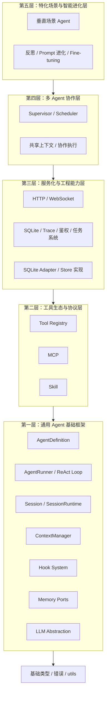

阅读重点：

- 第一层不是服务层，也不是工具层
- 第一层真正提供的是“运行时内核 + 稳定 contract + 扩展点”
- 第三层可以实现 Store adapter，但不应把数据库细节塞回第一层

---

## 3. 第一层内部边界图

这张图回答的是：**第一层内部有哪些核心模块，它们之间应该怎么依赖。**

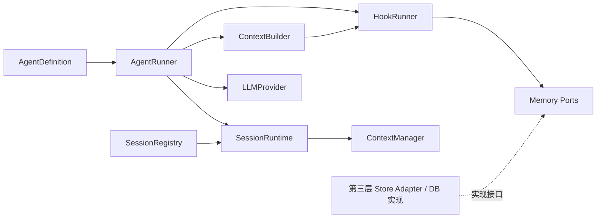

阅读重点：

- `AgentRunner` 是执行中心，但不是数据存储中心
- `SessionRegistry` 管 Session 生命周期
- `SessionRuntime` 持有 `ContextManager`
- `Memory Ports` 是第一层接口，具体 DB 实现来自第三层

---

## 4. 核心对象关系图

这张图回答的是：**几个最容易混淆的对象，到底谁是静态定义、谁是运行态、谁是隔离容器。**

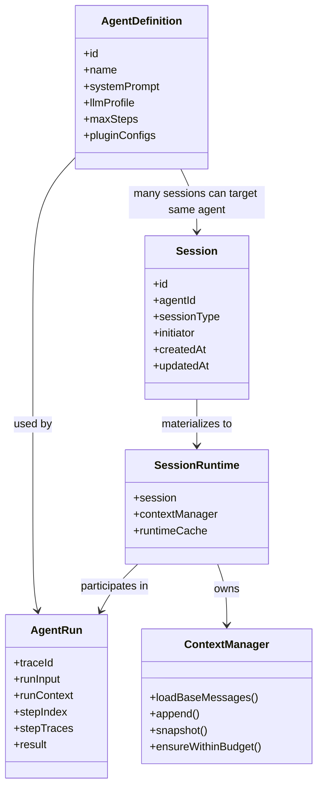

一句话概括这张图：

- `AgentDefinition` 是“谁”
- `Session` 是“属于谁”
- `SessionRuntime` 是“这次会话在内存里有什么”
- `AgentRun` 是“这次执行正在发生什么”

---

## 5. 所有权与生命周期图

这张图回答的是：**什么东西应该长期存在，什么东西应该跟着 run 或 session 销毁。**

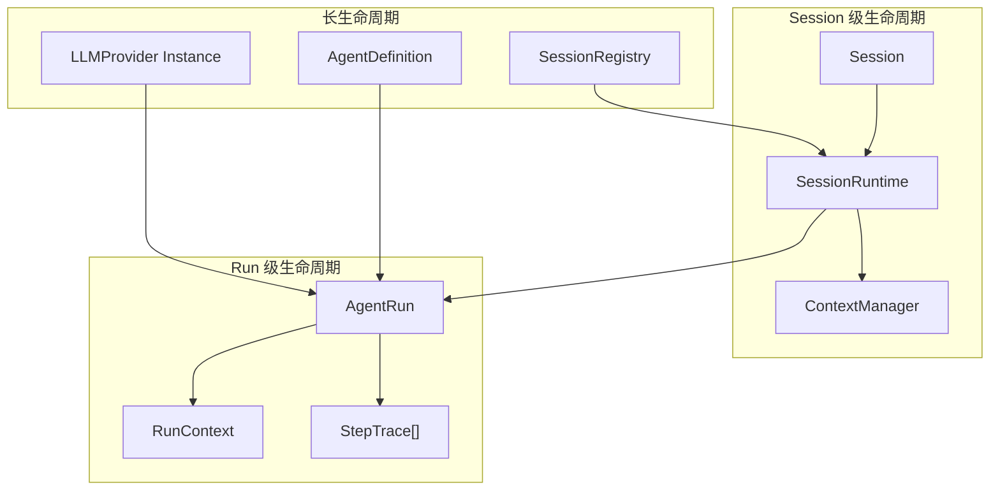

阅读重点：

- `AgentDefinition` 可以复用
- `SessionRuntime` 是会话隔离资源
- `AgentRun` 一次调用一个，结束即销毁
- 如果把 `ContextManager` 放到 `AgentDefinition`，这张图就会断裂

---

## 6. 一次 `run()` 的核心时序图

这张图回答的是：**从用户输入到拿到最终结果，中间的核心时序是什么。**

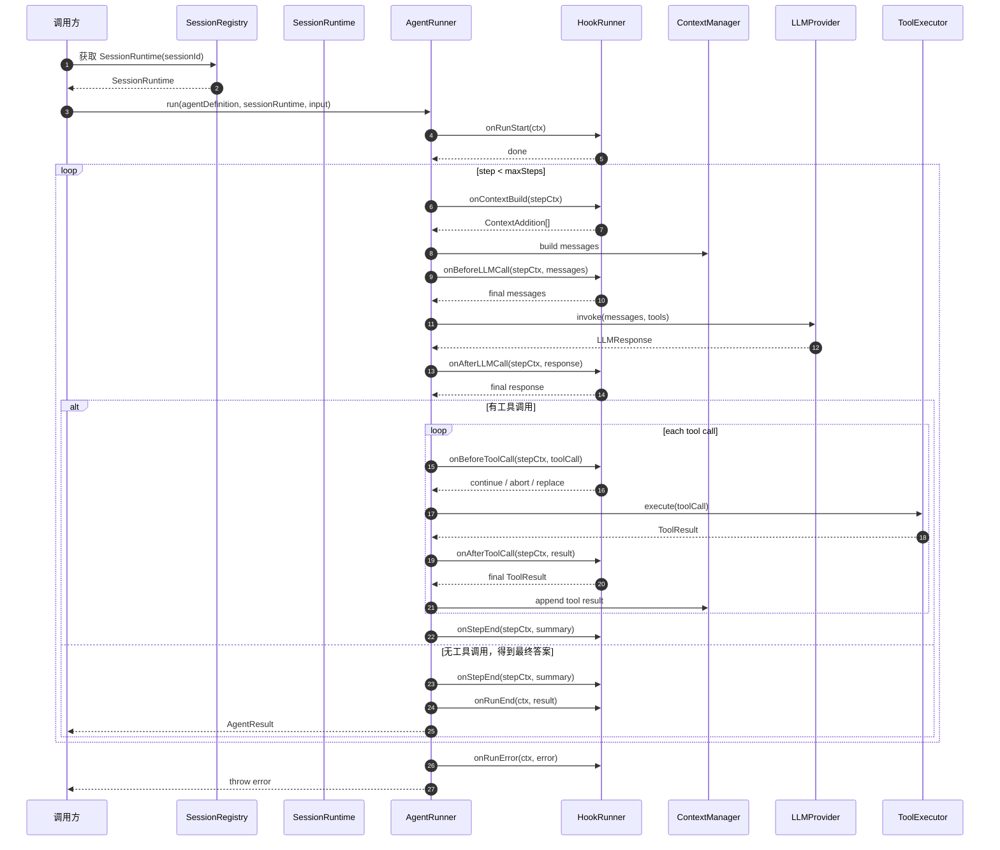

阅读重点：

- Hook 不只是前后包一层，而是插在多个关键点
- 每次 LLM 调用前都要重新构建 context
- 工具结果不是直接结束，而是会被回注到 context 中继续推理

---

## 7. Hook 插入点总览图

这张图回答的是：**第一层为什么一定要内建 Hook，以及每个 Hook 的位置在哪里。**

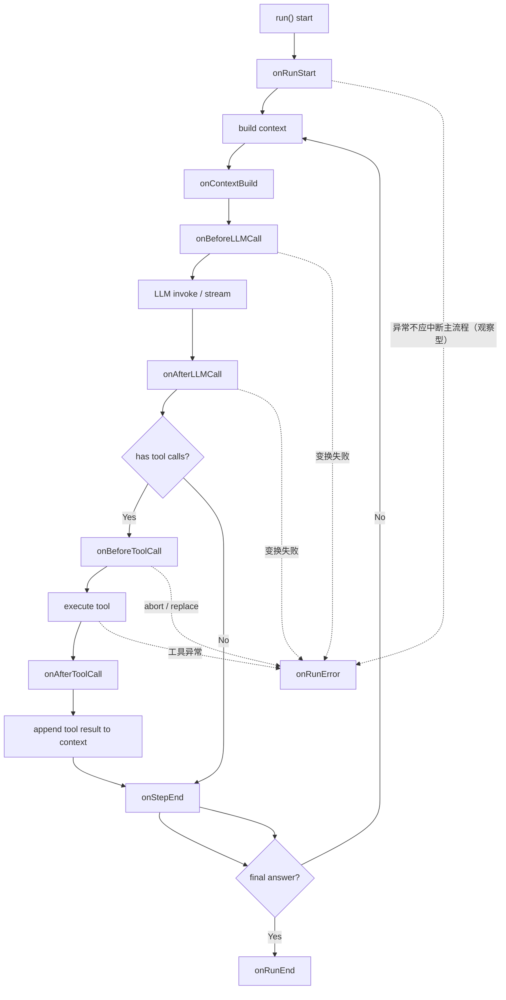

阅读重点：

- `onContextBuild` 和 `onBeforeLLMCall` 不是一回事
- `onAfterLLMCall` 是工具执行前最后一个“全局拦截点”
- `onBeforeToolCall` 是每个工具调用级别的最后一道门

---

## 8. Context、History、LongTermMemory 的数据流向图

这张图回答的是：**三个最容易搅在一起的模块，分别在什么时候参与，数据怎么流。**

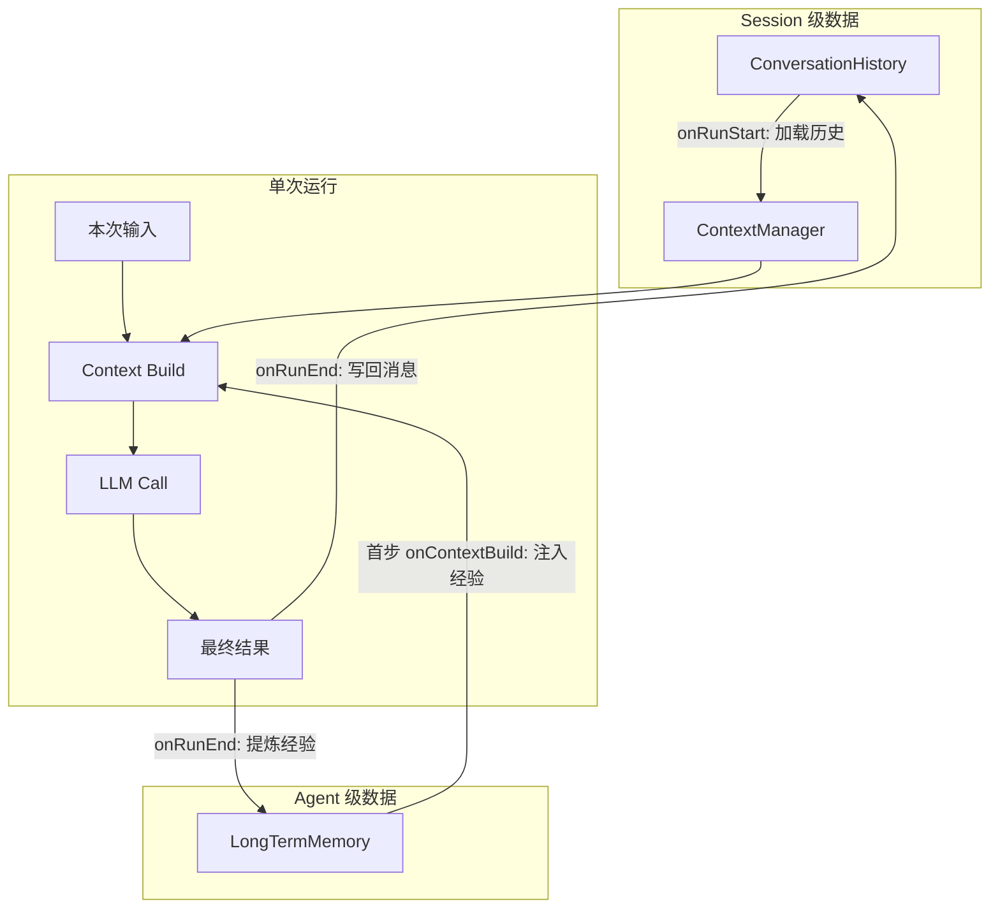

阅读重点：

- `ConversationHistory` 是按 `sessionId` 的“档案室”
- `LongTermMemory` 是按 `agentId` 的“经验库”
- `ContextManager` 是本次运行给 LLM 的“工作台”

---

## 9. Session 隔离与共享资源图

这张图回答的是：**多会话并发时，哪些资源必须分开，哪些资源可以共享。**

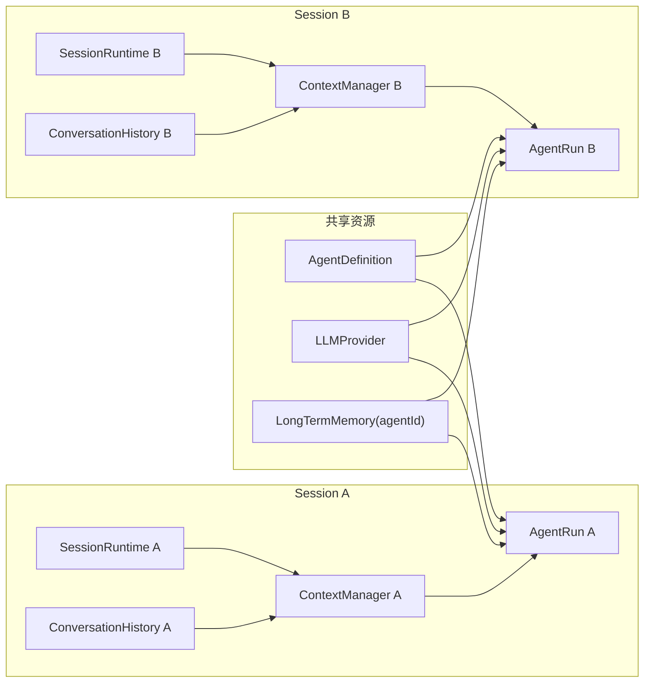

阅读重点：

- 同一个 AgentDefinition 可以同时服务多个 Session
- 每个 Session 都必须有自己的 `ContextManager`
- 长期记忆可共享，但会话历史绝不能共享

---

## 10. 第一层与第三层存储边界图

这张图回答的是：**为什么第一层要定义 port，而不是直接绑数据库。**

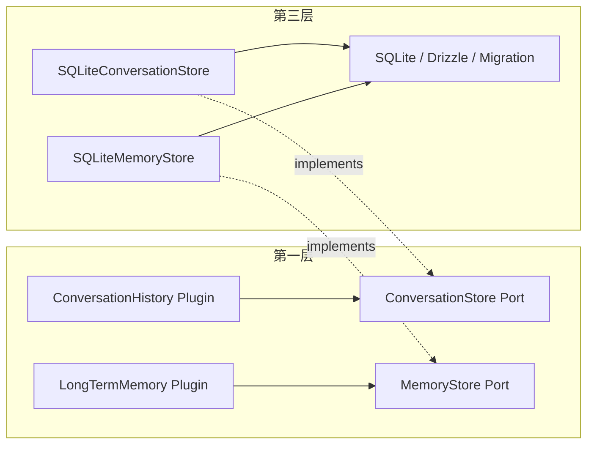

阅读重点：

- 第一层应当知道“需要什么能力”
- 第三层负责“这些能力怎么落到存储里”
- 这样数据库换实现时不会重写核心层

---

## 11. 执行细节流程图：一次完整推理

这张图回答的是：**站在实现角度，一次执行从进入到结束，内部决策路径长什么样。**

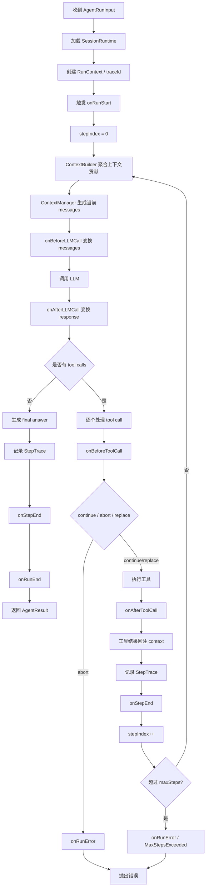

这张图适合回答“如果我要开始写 `AgentRunner`，骨架该怎么搭”。

---

## 12. 并发安全图

这张图回答的是：**哪些对象如果放错位置，就会产生串台和并发污染。**

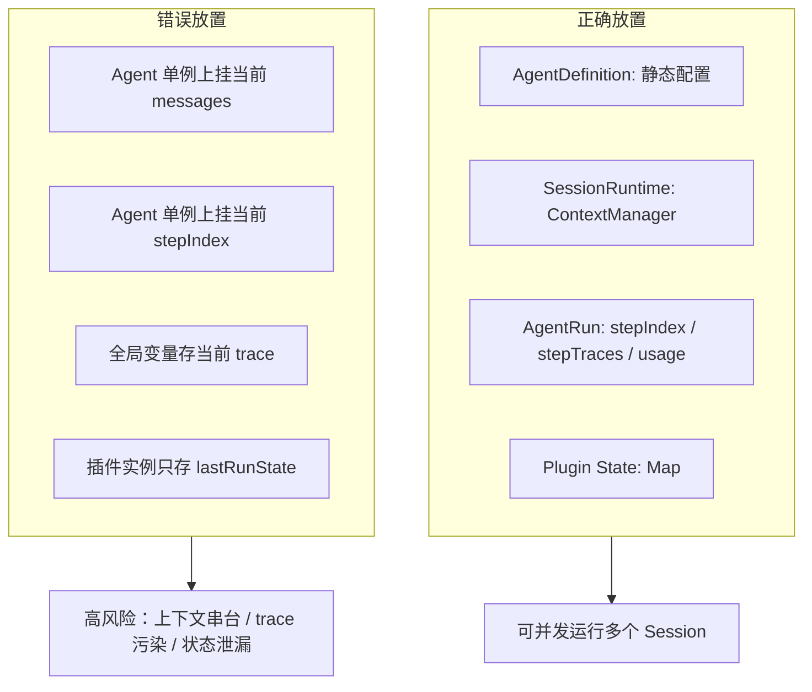

阅读重点：

- 第一层并发问题本质上是“运行态对象放错层”
- 解决办法不是引入复杂锁，而是把生命周期和所有权设计对

---

## 13. 第一层推荐实现顺序图

这张图回答的是：**如果按这份设计落地，先做什么、后做什么更稳。**

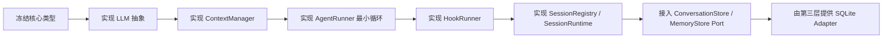

阅读重点：

- 先稳 contract，再补能力
- 不要一开始就把数据库、HTTP、任务系统灌进第一层

---

## 14. 建议你重点看的几张图

如果你时间有限，建议优先看这 4 张：

1. “核心对象关系图”：判断对象建模是否自洽
2. “一次 `run()` 的核心时序图”：判断运行机制是否闭环
3. “Context、History、LongTermMemory 的数据流向图”：判断边界是否清楚
4. “Session 隔离与共享资源图”：判断能否支撑并发和上层扩展

---

## 15. 总结

这份图册的核心目的不是把设计“画得更漂亮”，而是把几个最容易口头说混的点变成可视化结构：

- 第一层是运行时内核，不是服务层
- `AgentDefinition`、`SessionRuntime`、`AgentRun` 必须分层
- `ContextManager` 必须属于 Session
- Hook 是上层能力接入第一层的标准接口
- 记忆和持久化必须通过 port 隔离
- 并发安全的关键不在锁，而在所有权与生命周期

如果你愿意，我下一步还可以继续补两类图：

- 面向实现的“TypeScript 类型关系图”
- 面向评审会议的“单页总览图”

