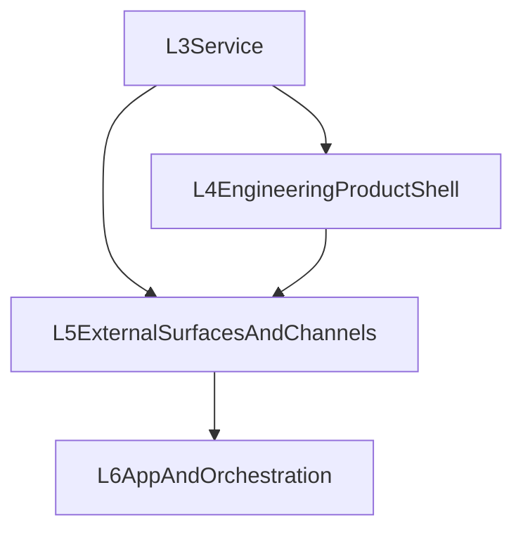

# Layer 4 Design：Engineering Product Shell

## 一句话定位

第四层负责把 `TheWorld` 从“有后端服务和若干 API 的系统”提升为 **不依赖外部渠道或 remote client 也能成立的完整工程产品**。

它首先回答的问题不是“怎么接企业微信/飞书/Telegram”，而是：

> 只靠本地 workspace、本地 server、CLI/TUI，用户能不能获得接近 `opencode` / `claudecode` 的完整工作体验？

---

## 为什么第四层必须独立出来

如果没有独立第四层，系统会很快退化成：

1. 认为“产品能力 = service endpoint 数量”
2. 认为“真正完整体验要等 Web / Desktop / channel 接入后再说”
3. 把 context、memory、approval、background 等关键体验塞进各个壳层临时逻辑
4. 让 channel / remote client 反向定义产品语义

第四层要做的，是先让 **terminal-first 工程产品** 成立。

---

## 设计目标

1. **本地可独立成立**：没有 channel / remote client 时，产品能力已闭环
2. **single-agent 完整**：先让一个 agent 长期、稳定、可控地工作
3. **工程产品化**：不仅能聊天，还能 inspect、resume、approve、recover、background
4. **上下文可解释**：context、memory、rules 不再是黑箱
5. **权限可交互**：approval / denied / resumed 成为正式产品流程

---

## 第四层的核心对象

### 1. Product Shell

第四层的主对象不是 channel adapter，而是本地工程产品壳。

建议至少包含：

- `HomeShell`
- `ConversationShell`
- `InspectSurface`
- `TaskSurface`
- `LogsSurface`
- `SessionThreadSurface`

### 2. Product Control Plane

为了让 CLI/TUI 真正像产品而不是调试面，第四层需要自己的产品控制面。

**099** 已冻结：与 L3 数据源的归类型映射、与 CLI 命令的对应关系见 [L4_PRODUCT_SHELL_MAP.md](../../../architecture-docs-for-agent/fourth-layer/L4_PRODUCT_SHELL_MAP.md) 与 [L4_PRODUCT_CONTROL_PLANE.md](./L4_PRODUCT_CONTROL_PLANE.md)（**本地语义，非 L5 remote control plane**）。

建议至少包含：

- run status
- context usage
- memory contribution
- approval state
- background session state
- recoverability state

### 3. Session Continuity Model

本地产品必须冻结：

- attach
- resume
- continue
- interrupt
- background
- recover

这些动作的产品语义，而不只是零散命令。

### 4. Single-Agent Workflow

第四层要承接的是单 agent 的工程工作流，而不是多 agent 编排。

建议至少包含：

- `plan`
- `review`
- `execute`
- `inspect`
- `recover`

---

## Context Engineering 的第四层归属

用户要的不是“底层会自动压缩”，而是 **上下文工程**。

这在第四层应表现为：

- 当前上下文大概用了多少
- 哪些消息被 compact 了
- 哪些 memory 被注入
- 哪些规则属于固定系统约束，哪些属于当前工作态

也就是说：

- 第一层负责最小机制
- 第四层负责把这些机制变成可理解、可观察、可工作的产品能力

---

## 多层记忆系统的第四层归属

同理，多层记忆系统不应该只存在于内部抽象里。

第四层应定义至少三类产品叙事：

1. 当前会话工作记忆
2. 历史摘要 / 对话摘要
3. 长期记忆 / workspace 记忆

并为它们提供：

- inspect
- save / pin
- ignore / summarize
- source visibility

---

## Permission / Approval 的第四层归属

`opencode` / `claudecode` 这类产品之所以成立，一个关键点是：权限不是隐性实现细节，而是产品交互的一部分。

第四层必须冻结：

- permission mode
- approval request
- approved / denied / blocked / resumed
- tool capability summary
- 当前会话的安全边界显示

只有这样，用户才是在使用“可控 agent 产品”，而不是“偶尔会弹出错误的自动化脚本”。

---

## Background / Resume / Recover

第四层必须承认真实工程产品不是永远前台同步一次做完。

因此它至少应具备：

- foreground session
- background session
- attach / detach
- recover after failure
- continue after approval

这决定了 TheWorld 是否只是“聊天壳”，还是能承接长时间任务的工程产品。

---

## 与第三层的关系

第三层负责：

- session / run / stream / task / trace / logs / status 之类基础 service primitives

第四层负责：

- 用这些 primitives 组成完整的本地工程产品

因此，不应简单把“第四层没做完”理解成“第三层应该包揽全部产品能力”。

更准确的说法是：

- 第三层需要补齐支撑第四层的基础 primitives
- 但完整产品能力本身仍属于第四层

---

## 当前对第三层的反向要求

为了让第四层成立，第三层后续仍可能需要补这些基础：

- 更稳定的 event plane
- active run / background run identity
- context / memory / approval descriptors
- 更适合产品层消费的 snapshot / status contract

这类需求是 **L3 为 L4 提供基建**，而不是把 L4 吞回 L3。

---

## 与第五、第六层的关系

说明：

- 第四层先让本地产品成立
- 第五层再把这些能力外扩到 Web / Desktop / channel
- 第六层最后在此基础上做 team / workflow / app

---

## 推荐执行波次

### Wave 1：L3 -> L4 substrate gaps

- event plane
- background / active run primitives
- context / memory / approval descriptors

### Wave 2：L4 product completeness

- context engineering
- layered memory
- permission / approval
- background / resume / recover
- single-agent workflow

### Wave 3：L4 shell polish

- 把 TUI / CLI 从“可用”提升到“完整工程产品”

---

## 当前结论

第四层不是“渠道接入前的一层过渡”，而是 **TheWorld 先成为完整工程产品的那一层**。

如果这一层没有成立，那么后面的 Web / Desktop / channel 接入，只会把一个尚未完成的产品外扩出去，而不会让系统真正变完整。
