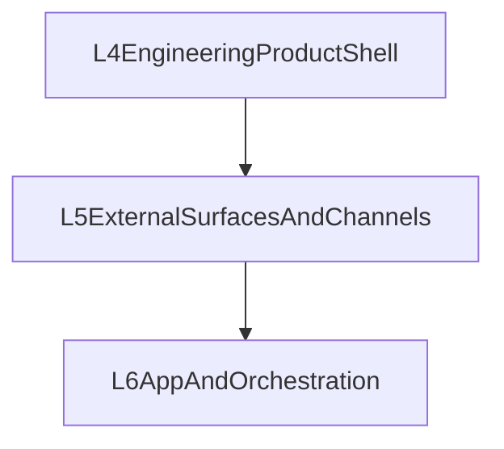

# Layer 5 Design：External Surfaces And Channel Access

## 一句话定位

第五层负责把 **已经在第四层成立的工程产品能力** 外扩到更多入口。

它不是用来“补完本地产品”的，而是用来处理：

- Web / Desktop / remote client
- SDK
- channel adapter / account / pairing / presence
- multi-surface continuity
- remote control plane

---

## 为什么第五层不应早于第四层

如果第五层先行，系统会退化成：

1. 还没有完整本地产品，就急着做 remote surfaces
2. Web / Desktop / channel 各自定义自己的 session / approval / background 语义
3. 把 channel 误当成完整产品能力的来源

因此正确顺序应是：

1. 第三层提供服务底座
2. 第四层先让 terminal-first 产品成立
3. 第五层再把这些产品能力外扩出去

---

## 设计目标

1. **外扩而不反向定义**：外部入口复用产品语义，而不是重新发明
2. **多入口连续性**：同一个 session / run / approval / background 状态可跨 surface 观察
3. **channel 是入口，不是前提**：渠道接入属于扩展，不是产品本体
4. **remote control plane 成型**：远程管理面与多入口观察面有统一 contract

---

## 第五层的对象

### 1. External Client Interfaces

包括：

- `sdk/client`
- `sdk/operator-client`
- future remote subscription / control-plane client

### 2. Channel Access

包括：

- `channel-core`
- account lifecycle
- pairing / allowlist / invitation
- presence / delivery / routing

### 3. Multi-Surface Continuity

包括：

- session continuity
- background continuity
- approval continuity
- event continuity
- attach / inspect / recover across surfaces

### 4. Remote Control Plane

包括：

- 远程 inspect
- 远程 logs / tasks / runs / system status
- channel / account 管理面
- 远程 approval / recover / attach

---

## 第五层与第四层的边界

第四层定义：

- 本地产品能力是什么
- 单 agent 如何完整工作
- CLI/TUI 如何形成完整工程体验

第五层定义：

- 这些能力如何被外部入口复用
- 不同入口如何保持同一种产品语义
- channel / remote client 如何接入

因此第五层不是“另一个产品层”，而是 **产品能力的外扩层**。

---

## SDK 的第五层归属

第五层继续承接 SDK，但 SDK 的职责现在更明确：

- 不是为了替第四层定义产品心智
- 而是为了把第四层产品可依赖的 service / control-plane contract 带到更多入口

因此：

- `sdk/client` 承接基础 session / run / health 等能力
- `sdk/operator-client` 承接 trusted surface
- future remote clients 承接 continuity / event / control-plane 能力

---

## Channel Access 的第五层归属

现在 channel 归属到第五层，而不是第四层。

原因是：

1. channel 是一种外部入口
2. 它不应该定义单 agent 本地产品语义
3. 它需要复用第四层的 context / approval / background / session continuity 语义

第五层后续应冻结：

- account graph
- pairing / allowlist
- presence / delivery health
- session routing into product semantics
- representative platform adapter

---

## Multi-Surface Continuity

第五层的真正难点不只是“多做几个客户端”，而是“多个入口是否还是同一个产品”。

后续需要冻结：

- shared event identity
- attach / resume / inspect continuity
- background session continuity
- approval continuity
- reconnect / replay

如果没有这层，Web、Desktop、channel 都会变成各自孤立的壳。

---

## 第五层对第三层与第四层的要求

### 对第三层的要求

- 稳定的 public / operator / event primitives
- 可被 remote surfaces 消费的 status / log / task / run / stream APIs

### 对第四层的要求

- 明确的产品语义
- 明确的 approval / background / resume / recover 心智
- 明确的 context / memory / inspect 心智

只有这样，第五层才能做“外扩”，而不是“替代设计”。

---

## 与第六层的关系

说明：

- 第五层先把同一个产品带到更多入口
- 第六层再基于这些入口做 team / workflow / business app

---

## 推荐执行波次

### Wave 1：remote interfaces

- remote subscription
- remote control plane
- session / approval / background continuity

### Wave 2：channel access

- account / pairing / presence / routing
- 代表性平台打透

### Wave 3：multi-surface polish

- 把 Web / Desktop / channel 与本地产品闭环统一起来

---

## 当前结论

第五层不是“完整产品能力的定义层”，而是 **完整产品能力成立后的外扩层**。

如果第四层没有先成立，第五层做得越多，只会把不完整的产品复制到更多入口。
