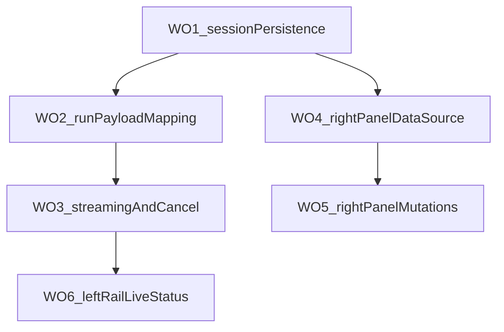

# 137 · Desktop 端到端补接入总工单（Master）

## 任务边界

本单目标是在现有 Desktop 界面基础上，补齐“已实现 UI 但未接入服务”的关键能力，采用 **总工单 + WO 子工单** 串行推进：

- WO-1 会话持久化接入
- WO-2 运行参数映射接入
- WO-3 流式渲染与取消接入
- WO-4 右栏数据源接入
- WO-5 右栏卡片操作接入
- WO-6 左栏实时状态接入

本单只定义执行顺序、边界和统一验收口径，不直接承载具体代码改动。

## 影响范围（冻结）

- 直接影响：`apps/desktop`（renderer + preload）
- 条件影响：`packages/server`、`packages/shared/contracts`（仅当现有接口不足以闭环）
- 文档影响：`docs/exec-plans/active/`、`docs/exec-plans/active/README.md`

## 不做什么

- 不并行推进多个 WO
- 不在未冻结边界前直接跨层大改
- 不做与 Desktop 补接入无关的架构重构
- 不在同一 WO 混入样式优化类杂项需求

## 依赖顺序

## 允许修改目录

- `apps/desktop/**`
- `packages/server/**`（仅限补接入必要改动）
- `packages/shared/contracts/**`（仅限补接入必要 DTO/route 定义）
- `docs/exec-plans/active/**`

## 不允许修改目录

- `packages/sdk/client/**` 对外接口
- `packages/sdk/operator-client/**` 对外接口
- 与本工单无关的 `apps/` 其他端产品目录

## 统一验收标准（所有 WO 共用）

- 每个 WO 必须可单独回归、可单独回滚
- 每个 WO 完成后至少执行：
  - `pnpm --filter @theworld/desktop check`
  - `pnpm verify`
- 文档状态同步到 `docs/exec-plans/active/README.md`

## 升级条件（命中即停）

- 需要新增跨层协议但无法在当前 WO 范围达成一致
- 需要修改禁止目录才能继续
- 连续两轮无法通过 `pnpm verify`
- 同一问题出现两种以上实施路径且影响后续 WO 顺序
