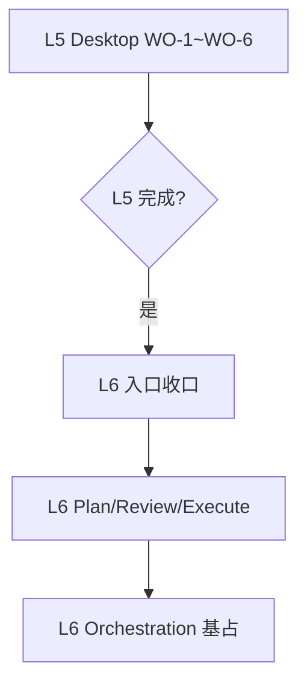

# 146 · L5 完成收尾与 L6 启动规划

## 任务边界

本单定义 L5 Desktop 客户端完成后的收尾范围，以及 L6 Orchestration 层启动的前提条件与首波工作单。

## 开发模式变更：从设计驱动到双向驱动

### 旧模式（已废弃）

- 预先 exhaustive 设计后端 contract
- 再开发客户端对接
- 弊端：contract 漂移、过度设计、客户端实际需求与设计不符

### 新模式（当前采用）

- **客户端驱动**：先开发客户端 UI，在实际对接中发现欠缺
- **最小闭环**：每发现一个必要能力，快速补充一个 contract
- **增量验收**：客户端每完成一个功能区，即验证整体可跑通

这种模式的优势：
1. 避免过度设计不存在的需求
2. 快速闭环客户端实际需要的最小能力
3. contract 与客户端实际使用对齐

## 当前状态摘要

### L5 客户端（Desktop）进行中

| WO | 主题 | 状态 |
|----|------|------|
| 138 | WO-1 会话持久化接入 | 进行中 |
| 139 | WO-2 运行参数接入 | 待启动 |
| 140 | WO-3 流式渲染与取消接入 | 待启动 |
| 141 | WO-4 右栏数据源接入 | 待启动 |
| 142 | WO-5 右栏卡片操作接入 | 待启动 |
| 143 | WO-6 左栏实时状态接入 | 待启动 |

### 双向驱动工作流

在 WO 开发过程中，允许**增量补齐**：

1. **发现缺口** → 在 WO 内以子任务形式快速补充
2. **最小闭环** → 只补齐该缺口必需的 contract
3. **继续开发** → 不阻塞主 WO 进度
4. **统一收口** → WO 完成后统一冻结扩展边界

示例：
```
WO-2 开发中，发现需要 agent 列表能力？
→ 快速新增子任务补 `GET /v1/agents`
→ 继续 WO-2 主流程
→ WO-2 完成后统一记录扩展了 agent list
```

### L4 已完成（099–106）

- 099 Product control plane and shell map
- 100 Onboarding setup discoverability
- 101 Context engineering surface
- 102 Layered memory product surface
- 103 Permission approval product flow
- 104 Background resume recover
- 105 Single-agent plan review execute
- 106 Terminal product shell polish

### L3 substrate 已完成（090–096、107）

- 090 Run identity and lifecycle
- 091 Unified event plane
- 092 Scheduler reliability and heartbeat
- 093 Approval and danger protocol
- 094 Context memory descriptors
- 095 Multimodal contract
- 096 Tooling exposure and introspection
- 107 L3 cron and heartbeat infra hardening

## L5 完成后的收尾范围

**⚠️ 前置条件（149）：** 在 L5 收尾冻结之前，必须先完成 Desktop bridge contract 收敛（执行计划 149）。当前 Desktop preload 和 http-desktop-bridge 三处独立 HTTP 客户端实现未收敛到 sdk/client，存在类型漂移、路由硬编码、重复鉴权/SSE 解析。如果不先收敛，L5 冻结的 contract 只停留在 sdk/client 层面，Desktop 实际仍在使用自己的私有 contract。

当 WO-1~WO-6 和 149 全部完成后，L5 客户端层需冻结以下 contract：

### A. External Client Surface（冻结）

| 能力 | 冻结边界 |
|------|----------|
| Session CRUD | `POST/GET/DELETE /v1/sessions` 不扩展 |
| Run create/stream/cancel | `POST createRun` + SSE stream + cancel 不扩展 |
| Messages | 分页列表 + 历史不扩展 |
| Agent 绑定 | 创建时 agentId / role preset 绑定不扩展 |

### B. Remote Control Plane Surface（冻结）

| 能力 | 冻结边界 |
|------|----------|
| Tasks CRUD | `POST/GET/DELETE /v1/tasks` 不扩展 |
| Session runs | `GET /v1/sessions/:id/runs` 不扩展 |
| System status | `GET /v1/system/status` 不扩展 |
| Inspect surfaces | context/memory/approvals/resume/runs 视图 |

### C. Desktop 端到端（冻结）

- 左栏：会话列表 + cron/heartbeat 状态
- 中栏：对话气泡 + Markdown + KaTeX + 过程可视化
- 右栏：信息流面板（候选/冻结/摘要）

### D. 不做什么（冻结）

- 不扩展 Web 客户端
- 不扩展 channel adapter 真实接入
- 不扩展 multi-surface continuity（留待 L5 后续）
- 不扩展 remote control plane 完整实现（留待 L5 后续）

## L6 启动前提条件

L6 Orchestration 层启动必须满足：

### 前提 A：L5 客户端验收通过

- `pnpm verify` 全量通过
- Desktop 可独立启动并完成 full run cycle
- 无阻塞的 contract 问题

### 前提 B：L4 产品闭环已验证

- CLI/TUI 所有 surface 可独立工作
- context/memory/approval/background 可 inspect

### 前提 C：文档已冻结

- L5 客户端 contract 边界已记录
- L4 产品 shell map 已稳定

## L6 首波工作单（146+）

### 146 · L6 Orchestration 入口收口

**目标**：冻结 L6 Orchestration 层边界、首层工作对象与执行前提。

**影响范围**：

- `docs/architecture-docs-for-agent/sixth-layer/APP_AND_ORCHESTRATION.md`
- `docs/exec-plans/active/README.md`

**不做什么**：

- 不实现 subagent/team 具体代码
- 不扩展 L3/L4 contract
- 不做 multi-agent 具体产品

**实施步骤**：

1. 确认 L6 层级定位（不重复 L4/L5 已完成能力）
2. 冻结 Plan/Review/Execute 产品对象边界
3. 冻结 Subagent/Team/Orchestrator 概念边界
4. 定义 L6 与 L4/L5 的责任分割线
5. 注册 `test:l6-orchestration` 占位测试

**验收标准**：

- L6 文档更新���冻结边界
- README.md 已同步推进队列
- `pnpm verify` 通过

**升级条件**：

- L5 客户端 WO 未完成
- L4 surface 仍有阻塞问题

### 147 · L6 Plan/Review/Execute 产品原型

**目标**：在 L4 `theworld plan` 基础上，扩展为 L6 层级的 plan 工件管理。

**影响范围**：

- `packages/cli/**`
- `.theworld/plan/`（扩展）

**不做什么**：

- 不实现 team/subagent
- 不扩展 L3 contract
- 不做实时 orchestration

**实施步骤**：

1. 扩展 plan artifact 支持多版本
2. 添加 review 标记（pending/approved/revised）
3. 添加 execute 记录（run-id 关联）
4. 扩展 `theworld plan` CLI 支持 review/execute 子命令

**验收标准**：

- plan 可创建/查看/review/execute
- review 状态持久化
- `pnpm verify` 通过

**依赖**：

- 146（L6 入口收口）已完成

### 148 · L6 Orchestration 基础设施占位

**目标**：为未来的 subagent/team/workflow 搭建基础设施占位。

**影响范围**：

- `packages/server/**`（新增路由占位）
- `packages/sdk/operator-client/**`（新增方法占位）

**不做什么**：

- 不实现具体 orchestration 逻辑
- 不扩展 L3/L4 contract
- 不做真实 team 管理

**实施步骤**：

1. 添加 `POST /v1/orchestrations` 占位路由
2. 添加 `GET /v1/orchestrations` 占位路由
3. 添加 operator-client 方法占位
4. 注册 `test:orchestration` 占位测试

**验收标准**：

- 占位路由返回 501 Not Implemented
- operator-client 方法返回空或占位数据
- `pnpm verify` 通过

**依赖**：

- 147（Plan/Review/Execute 原型）已完成

## 执行顺序



## 风险与约束

### 风险

1. **L5 未完成阻塞**：L6 启动依赖 L5 全部 WO 完成
2. **contract 漂移**：L6 实施中可能反向污染 L3/L4 contract
3. **scope creep**：orchestration 容易被放大为"再做一遍 L4"

### 约束

1. L6 首波工作单必须是 **收口/原型/占位**，不是完整实现
2. 不允许在 L6 实现中扩展 L3/L4 已冻结的 contract
3. 每个 WO 完成后必须 `pnpm verify` 通过

## 后续工作单预告

当 146–148 完成后，L6 可启动以下工作单：

- 149：Subagent 原型（短生命周期 agent 调用）
- 150：Team 基础结构（lead + teammate 模式）
- 151：Workflow 编排基础（plan → review → execute 流）
- 152：Background orchestration registry

具体范围在 146 完成后细化。