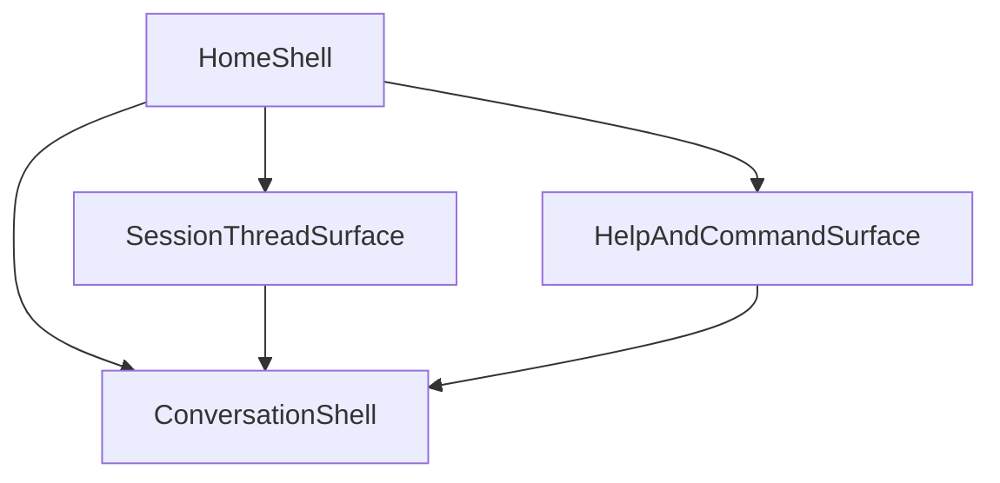

# TheWorld CLI Shell Parity Design

## 目标

本文件冻结 TheWorld CLI 的**shell 级产品对齐方向**。

它解决的问题不再只是“当前 TUI 不够精致”，而是重新定义整套 CLI shell：

- 首页 / 空态是什么
- 活跃对话界面如何组织
- session / thread 如何进入、切换、恢复
- help / command surfaces 如何变成真正的产品入口
- line UI 与 TUI 如何共享同一设计系统和交互语言
- 哪些差距可以在 CLI 壳层内解决，哪些必须进入下一阶段 contract 路线

本文件是新的 `067+` shell parity 工单序列与后续 contract-gap 文档的上游冻结依据。

---

## 为什么需要升级为 shell 级重设计

当前差距已经不是“一个 transcript 组件不够好看”，而是整套产品壳层与参考项目存在系统性差距：

1. **缺少真正的 home shell**：当前更像“进来就进聊天”，而不是产品级终端入口。
2. **活跃对话仍偏 debug shell**：虽然已经开始语义块化，但 transcript、status、tool、session identity、输入区仍没有形成成熟 CLI 的稳定层次。
3. **session / thread 体验太弱**：用户进入、恢复、切换会话的路径没有形成产品闭环。
4. **命令与帮助面不够产品化**：help 仍更像文档输出，而不是产品级命令入口。
5. **验证口径不够**：当前自动化主要证明“CLI 没坏”，不能证明 shell 体验已经达到目标水位。

---

## 对齐目标

新的 TheWorld CLI shell 应达到以下标准：

1. **先匹配，再超越**：先达到 OpenCode / Claude Code 级别的清晰度、完成度与产品一致性，再谈差异化。
2. **CLI 是完整产品面，不是附属调试壳**：home、chat、session、help、状态、输入都必须按产品心智设计。
3. **line UI 与 TUI 是同一产品**：共享身份规则、命令语义、视觉 token 与 degraded-mode 逻辑。
4. **壳层优先，但不自欺**：Wave 1 在既有 contract 内做到极限；Wave 2 对必须新增的能力单独建立 contract 路线，不在 shell 层偷造字段。

---

## 参考吸收原则

### 1. 吸收 OpenCode

- home / 空态有明显品牌位与产品入口感
- transcript / 输入 / rails 的信息分区明确
- CLI 本身是主产品面，不是纯脚本包装
- 富终端与降载路径分离

### 2. 吸收 Claude Code / Desktop

- 先语义 token，再颜色值
- 状态、错误、提示、输入区有严格角色系统
- 交互 affordance 明确，不靠一堆散落 hint 拼起来
- shell 不是平铺日志，而是被设计过的工作界面

### 3. 明确不复制

- 不迁移 OpenTUI / Solid / Bun renderer
- 不照搬完整 ThemeProvider / 多主题矩阵 / auto theme
- 不引入假 `plan/build/permission` 模式标签
- 不因为参考项目更强就直接复制它们的架构层级

---

## Shell 级信息架构

新的 shell 应覆盖四个产品 surface：

1. `HomeShell`
2. `ConversationShell`
3. `SessionThreadSurface`
4. `HelpAndCommandSurface`

---

## 1. Home Shell

Home shell 是当前缺失最明显的产品面。

它不是“空 transcript + logo”，而应承担：

- 品牌位
- 当前 shell 的主要入口
- 最近 threads / resume affordance
- 常用 command / slash / inspect 的可发现性
- shell 当前上下文摘要

### 设计原则

- 用户进入 shell 时，先看到“我现在可以做什么”，而不是先看到一块空聊天日志框。
- home shell 必须对新用户和老用户都友好：
  - 新用户：能迅速开始一次对话
  - 老用户：能恢复、切换、继续工作
- home shell 与 active chat shell 共享同一视觉语法，但信息密度更偏入口而非正文

### Wave 1 约束

- 只使用现有 session / messages / env / help 面能力
- recent thread 展示优先消费已有 `listSessions`
- 不在本轮要求服务端返回专门的 home shell DTO

---

## 2. Conversation Shell

Conversation shell 是工作主界面。

它固定采用三层结构：

- `Header`
- `TranscriptViewport`
- `FooterAndInput`

与此前 TUI-only 设计相比，这里把它提升为 shell 级规则，而不只是 TUI 局部组件设计。

### Header

Header 负责：

- 品牌位
- 当前 session identity
- 当前 run phase
- 高优先级模式 / 状态提示

Header 不负责：

- 长错误正文
- 大段 tool 输出
- context 统计堆叠

### TranscriptViewport

TranscriptViewport 是主阅读区域。

它必须具备：

- 语义块级 transcript
- 视口 / scrollback 心智
- turn grouping 能力
- assistant / tool / error / hint 的明确层级

它不应再是：

- 一串被美化的字符串行

### FooterAndInput

FooterAndInput 负责：

- draft 编辑
- 当前输入模式
- host / model / agent / context 等稳定环境信息
- 键位提示
- run busy / blocked / failed 的即时反馈

输入区必须成为 footer 的一部分，而不是正文末尾插入一行。

---

## 3. Session / Thread Surface

session / thread surface 必须从“知道 id 才能继续”的技术路径，升级为产品路径。

### 统一身份规则

整个 CLI shell 统一使用：

1. `displayName`
2. `alias`
3. `shortId`

### shell 内承载规则

- Home shell：展示最近 thread 的主标题和简短元数据
- Conversation header：主显示 `displayName`
- Footer / status rail：展示 `alias` 与 `shortId`
- list / picker / resume / errors：始终保持同一叙事顺序

### 目标交互

- 用户可从 home / chat / picker 任一入口进入最近 thread
- `--resume`、`--continue`、`--pick`、session list、TUI 内 thread affordance 应叙事一致
- thread surface 最终应支持：
  - recent threads
  - attach / switch / resume
  - 稳定的身份可见性

Wave 1 不强制实现完整 sidebar thread list，但必须冻结它的产品位置与行为目标。

---

## 4. Help / Command Surface

help 不是文档 dump，而是 shell surface 的一部分。

它应承担：

- command discoverability
- global flags discoverability
- chat / sessions / inspect / tasks 的入口说明
- shell affordance discoverability

### 目标状态

- root help、topic help、shell hint、home shell affordance 叙事统一
- 用户不需要先翻文档，进入 CLI 即可理解：
  - 如何开始对话
  - 如何恢复 thread
  - 如何切换命令面
  - 哪些是本地 slash，哪些是 server surface

Wave 1 不强制引入完整 command palette，但必须为其留出产品位置。

---

## Transcript 语义模型

conversation shell 继续采用语义块模型，而不再回退为字符串流。

冻结的 block 类型：

- `user`
- `assistant`
- `tool_call`
- `tool_result`
- `note`
- `error`
- `system_hint`

### 额外产品要求

- transcript 应有清晰 turn 边界心智
- tool 信息默认展示摘要，不默认展开整屏原始日志
- `failed` 必须同时体现在状态位和一个完整 `error` block 中
- 不再靠 `--- run start ---` / `--- run end ---` 组织界面

---

## 运行状态与控制面

冻结的 run phase：

- `idle`
- `thinking`
- `streaming`
- `failed`
- `completed`

### 壳层归属

- Header：高优先级运行态
- Footer/status rail：稳定环境态
- Transcript：仅保留必要语义事件，不重复 phase 文案

### 对标要求

新的 shell 应开始具备接近参考项目的运行态控制心智：

- 用户知道当前在等待什么
- 用户知道当前能否输入
- 用户知道当前能否中断 / 切换 / 继续

Wave 1 先冻结 UI/UX 位置；Wave 2 再处理真正需要 contract 的 run lifecycle 差距。

---

## 输入与命令 affordance

输入区不能再只是“能打字”。

冻结目标：

1. 输入态显式区分：
   - `idle`
   - `busy`
   - `blocked`
2. draft、cursor、placeholder、status hint 必须同步
3. slash / command affordance 必须可发现，而不是靠用户记忆
4. TUI 与 line UI 的命令语法与叙事必须收口

### Wave 1

- 优先把 draft editing model、footer grammar、slash discoverability、resume/switch affordance 做成产品化
- 不承诺一次完成参考项目级的完整 command palette，但要冻结为明确下一步

---

## 设计系统

本轮不引入大型主题系统，但必须冻结一个 shell 级设计系统。

最小语义角色集：

- `brand`
- `accent`
- `muted`
- `dim`
- `panelBorder`
- `user`
- `assistant`
- `tool`
- `success`
- `warning`
- `danger`
- `focus`

### 规则

1. line UI 与 TUI 必须从同一 token 源派生
2. 不允许继续在组件内散写临时颜色
3. panel / rail / transcript / footer 的层级必须由 token 与组件角色共同决定
4. 动效是设计系统的一部分，不是散落在组件里的局部实现

---

## 降载策略

### `NO_COLOR` / `TERM=dumb`

- 去掉颜色
- 去掉不必要动效
- 保留布局、标签、缩进、顺序与优先级

### 窄终端

- 优先保留 transcript 正文宽度
- 第二、第三优先级信息先收缩
- banner / rail 允许降级

### 非 TTY

- 不进入 TUI
- 继续遵守 line UI 的 human/machine 双轨 contract

---

## Wave 1 与 Wave 2 分层

### Wave 1：仅 CLI shell 内收口

Wave 1 目标是：**在既有 contract 内做到最强 shell parity**。

包含：

- home shell
- active conversation shell
- session/thread UX
- input/footer/command affordance
- shared shell design system
- validation harness 与人工 review matrix

### Wave 2：进入 contract roadmap

当以下差距无法继续只靠壳层解决时，进入 Wave 2：

- richer thread metadata
- 更强的 run interruption / attach-to-run 能力
- 更准确的 model/runtime/tool visibility
- token / cost / context 等更深 observability
- 真实 mode/capability signaling

Wave 2 必须单独进入 contract-gap 文档与后续 exec-plan，不在 Wave 1 实现中偷偷扩张。

---

## 成功标准

完成本轮 shell parity 的标志不是“颜色更像 OpenCode”，而是：

1. TheWorld 出现了真正的 shell 级产品设计，而不只是局部 TUI 美化。
2. `067+` 工单序列已经按产品 surface 拆分，而不是按局部实现文件拆分。
3. budget-mode 获得的是一条能顺序执行的 shell parity 路线，而不是继续在旧 `063`–`066` 上补丁。
4. contract gap 被显式文档化，不再混在壳层工单里模糊推进。
5. 验收模型从“脚本通过”升级为“自动化 + 手工 TTY/product review + benchmark 对照”。

---

## 不做什么

- 不复制 OpenCode / Claude Code 的实现架构
- 不迁移终端技术栈
- 不在本轮承诺完整多主题系统
- 不发明 fake `plan/build/permission` 标签来冒充产品能力
- 不在没有文档冻结的前提下让弱模型自行抽象参考项目方向

---

## 相关文档

- `docs/requirements/CLI_REFERENCE_SOURCES_INDEX.md`
- `docs/requirements/CLI_REFERENCE_OPENCODE_AND_DESKTOP_SRC_ANALYSIS.md`
- `docs/requirements/THEWORLD_CLI_SHELL_DESIGN.md`
- `docs/requirements/THEWORLD_TUI_PRODUCT_DESIGN.md`
- `docs/requirements/PROJECT_CLI.md`
