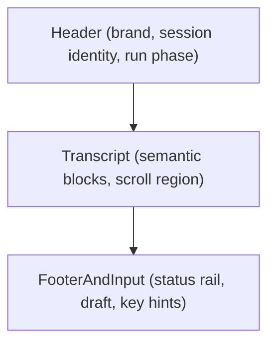

# TheWorld TUI Product Design

> **状态：作为 narrower TUI 子设计保留（2026-04-24）。** 本文继续冻结 transcript / layout / token / input 的 TUI 子问题，但新的主实施路径已提升为 shell 级 [`THEWORLD_CLI_SHELL_PARITY_DESIGN.md`](./THEWORLD_CLI_SHELL_PARITY_DESIGN.md) 与 `067`–`072`。

## 目标

本文件冻结 TheWorld 全屏 TUI 的**产品级设计方向**。

它解决的问题不是“在现有 Ink 界面上继续加一点点样式”，而是重新定义：

- TUI 的信息架构
- transcript 的语义模型
- session identity 的展示规则
- run 状态与错误的可视化方式
- line UI 与 TUI 共用的视觉 token
- 输入区、状态栏与降载路径的产品边界

本文件最初是 `063`–`066` 的上游冻结依据；当前则作为 shell parity 路线中的 TUI 子设计参考继续保留。

---

## 设计目标

新的 TheWorld TUI 应达到以下标准：

1. **不再像调试输出**：用户、assistant、tool、error、hint 都有清晰语义和稳定层级。
2. **不逊于参考项目的精致度**：吸收 OpenCode 的结构感和品牌位，也吸收 Claude Code / Desktop 风格的语义 token 与状态层次。
3. **不反向扩张 contract**：不为 TUI 新增 server 字段、token 计数 API、模式字段或新的 stream event。
4. **line UI 与 TUI 是一个产品，不是两套风格**：共享身份规则、共享 token、共享输出哲学。

---

## 参考路线

本设计采用 **hybrid** 路线：

- **吸收 OpenCode**
  - 壳层分区明确
  - transcript 结构清晰
  - 品牌区有存在感
  - 富终端与降载路径分离
- **吸收 Claude Code / Desktop**
  - 语义 token 先于具体颜色
  - 状态、错误、提示有统一角色系统
  - 输入区、状态区、正文区不是纯字符串堆叠

本设计**明确不**复制：

- OpenTUI / Solid / Bun renderer
- 完整 ThemeProvider / 多主题矩阵 / auto theme
- 新 server contract、token 精算、cost tracker、bridge
- fake `plan/build/permission` 模式带

---

## 当前问题

当前 TUI 的粗糙感主要来自以下根因：

1. transcript 仍是 `string[]`，事件很早就被压平成字符串，导致无法做高质量块级设计。
2. `run start/end`、tool、error、thinking 等很多状态仍以“调试文本”形式出现在界面中。
3. session identity 没有统一以 `displayName -> alias -> shortId` 叙事。
4. 视觉系统仍是局部颜色和局部组件风格的组合，没有单一 token 来源。
5. 输入区还停留在最小可用级别，缺少产品级的 idle / busy / blocked 视觉表达。

---

## 约束边界

本设计必须严格停留在当前已冻结的 contract 内：

- 只消费现有 `streamRun` 事件
- 只消费现有 `getSession()` / `getMessages()` / `agentId` / env labels
- 不新增 server endpoint / DTO / event
- 不改 `packages/sdk/client` 的对外能力面
- 不迁移到新终端栈

因此本设计的重点是**presentation architecture**，不是协议扩张。

---

## Shell 结构

新的 TUI 固定为三层结构：

### 1. Header

Header 负责：

- 品牌位
- 当前 session identity
- 当前 run phase 的强语义提示
- 非正文信息的收敛

Header 不负责：

- 打印长错误
- 堆放 context 统计细节
- 承担 transcript 事件日志

### 2. Transcript

Transcript 是主阅读区域。

它必须展示语义块，而不是任意字符串行。

### 3. FooterAndInput

底部区域负责：

- 当前 host / session / model / agent / context 近似统计
- 当前输入 draft
- 简短键位提示
- busy / blocked / failed 态的即时反馈

Footer 不是第二个 transcript。

---

## Transcript 模型

TUI transcript 不再以 `string[]` 为核心模型，而应升级为语义块列表。

冻结的 block 类型为：

- `user`
- `assistant`
- `tool_call`
- `tool_result`
- `note`
- `error`
- `system_hint`

### 块级语义

#### `user`

- 展示用户输入
- 是 transcript 的主时间线输入点

#### `assistant`

- 展示流式正文和最终回答
- 必须避免与纯状态文本混在一起

#### `tool_call`

- 展示工具名和紧凑输入摘要
- 不展示原始 JSON 大段噪音

#### `tool_result`

- 展示成功 / 失败的结果摘要
- shell/tool stdout/stderr 仅展示受控摘要，不展开成整屏日志

#### `note`

- 展示 reasoning / intermediate hint / compact note 之类的辅助说明
- 属于次级内容，视觉权重低于 `assistant`

#### `error`

- 统一承载 run failure、request failure、invalid input 等错误
- 错误在 transcript 中出现时必须是“完整块”，而不是夹杂在普通正文里

#### `system_hint`

- 展示 resume hint、non-TTY 提示、`/clear` 后的状态反馈等壳层提示
- 不与 model 生成内容混淆

---

## Run 状态模型

新的 TUI 不再用 `--- run start ---` / `--- run end ---` 表示生命周期。

冻结的 run phase 为：

- `idle`
- `thinking`
- `streaming`
- `failed`
- `completed`

### 状态归属

- **Header**：显示当前 phase 与高优先级状态
- **Footer/status rail**：显示更稳定的环境与 session 信息
- **Transcript**：只记录必要的语义事件块，不重复 phase 文案

### 规则

1. `thinking` 应优先进入 header/footer 的状态位，不强制在 transcript 里反复打印。
2. `failed` 必须同时反映到状态位与一个明确的 error block。
3. `completed` 不需要额外插入“run end”噪音行，除非真的需要一个 system hint。

---

## Session Identity

整个 CLI 产品的 session identity 统一冻结为：

1. `displayName`
2. `alias`
3. `shortId`

规则如下：

- 主显示名优先用服务端 `displayName`
- 本地 alias 仅作为补充，不替代服务端身份
- `shortId` 永远保留为最终唯一定位锚点

### 在 TUI 中的承载

- Header：主显示 `displayName`
- Footer/status rail：显示 `alias` 与 `shortId`
- 错误与 resume hint：使用 `shortId` 作为稳定引用

---

## Visual Tokens

本设计不引入大型主题系统，但必须冻结一组共享的语义 token。

最小角色集：

- `brand`
- `accent`
- `muted`
- `dim`
- `panelBorder`
- `user`
- `assistant`
- `tool`
- `success`
- `warning`
- `danger`
- `focus`

### 规则

1. line UI 与 TUI 必须从同一 token 源派生。
2. 不允许在 TUI 组件里继续散写与 token 无关的临时颜色。
3. `NO_COLOR` / `TERM=dumb` 下退化为：
   - 无颜色
   - 仍保留分区、缩进、标签与优先级

---

## Input Model

当前输入区“能打字”但还不够产品化，因此新的 TUI 输入区冻结为以下目标：

1. 明确区分：
   - `idle`
   - `busy`
   - `blocked`
2. 光标、提示文案、占位提示必须与状态同步。
3. 输入区应是 Footer 的一部分，而不是正文的末尾追加一行。

本轮不要求立刻实现完整 readline 级体验，但必须为后续 keyboard polish 保留清晰结构。

---

## 状态栏与信息密度

状态栏保留，但信息优先级重排如下：

第一优先级：

- run phase
- session identity
- host

第二优先级：

- model label
- agent id
- context 近似统计

第三优先级：

- key hints
- 轻量辅助提示

### 约束

- 窄终端下必须优先保留第一优先级
- 第二、第三优先级允许收缩或隐藏
- 不允许为了塞更多信息而让状态栏变成噪音源

---

## 降载策略

### `NO_COLOR` / `TERM=dumb`

- 保留布局、标签、顺序、缩进
- 去掉颜色与不必要动效
- transcript 仍按语义块组织

### 窄终端

- Banner 降级
- status rail 收缩
- transcript 优先保留正文宽度

### 非 TTY

- 不进入 TUI
- 继续走 line UI contract

---

## 目标界面心智

新的 TUI 应该让用户看到的是：

- 顶部：这是 TheWorld、我正在和哪个 session 交互、当前 run 在什么状态
- 中间：用户、assistant、tool、error 组成的干净 transcript
- 底部：现在可以输入什么、当前环境是什么、是否繁忙

而不是：

- 一串被美化过的日志行

---

## 新实路线图

本设计对应的旧 TUI 产品级工单序列为：

1. `063` transcript model 与 stream reducer 重建
2. `064` shell layout 与 session/status architecture
3. `065` shared visual tokens 与组件收口
4. `066` input / keyboard polish、narrow terminal、manual TTY matrix

当前新的主实施路径已经升级为 shell parity 的 `067`–`072`；旧的 `061`–`066` 均不再作为主实施路径。

---

## 不做什么

- 不迁移到 OpenTUI / Solid / Bun
- 不新增 server fields、mode fields、token 计数 API
- 不做完整多主题系统
- 不引入 fake `plan/build/permission` 模式
- 不把 transcript 做成调试控制台

---

## 相关文档

- `docs/requirements/CLI_REFERENCE_OPENCODE_AND_DESKTOP_SRC_ANALYSIS.md`
- `docs/requirements/THEWORLD_CLI_SHELL_PARITY_DESIGN.md`
- `docs/requirements/THEWORLD_CLI_SHELL_DESIGN.md`
- `docs/exec-plans/active/056_cli_chat_fullscreen_tui.md`
- `docs/exec-plans/active/057_cli_chat_tui_visual_identity.md`
- `docs/exec-plans/active/058_cli_chat_tui_lazyvim_dashboard.md`
